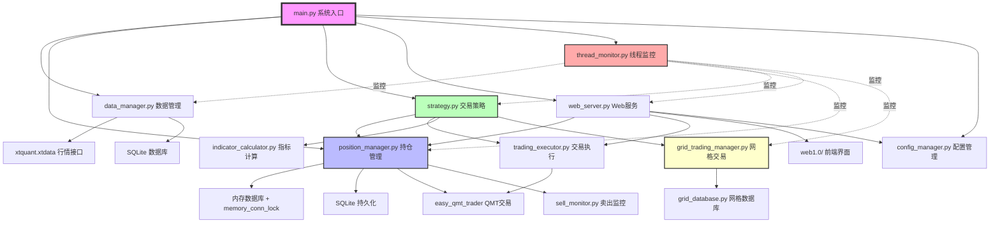
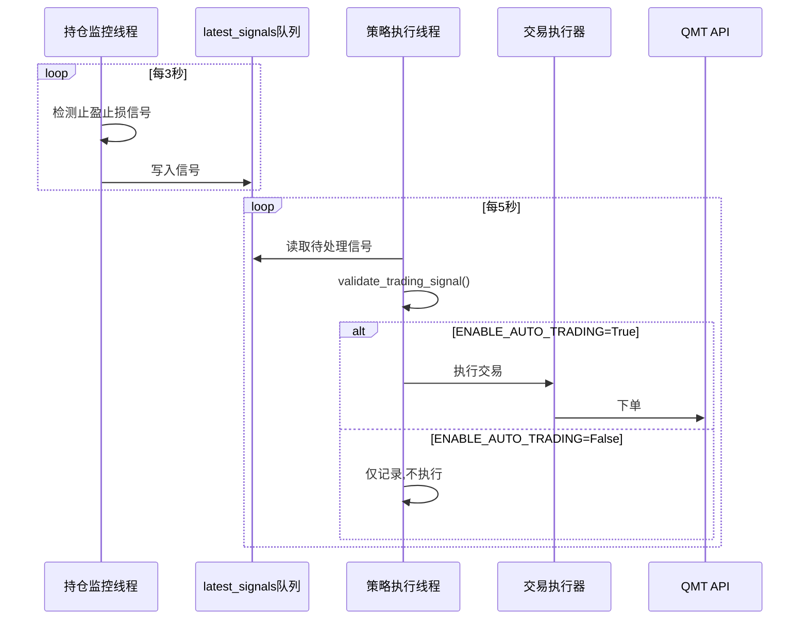
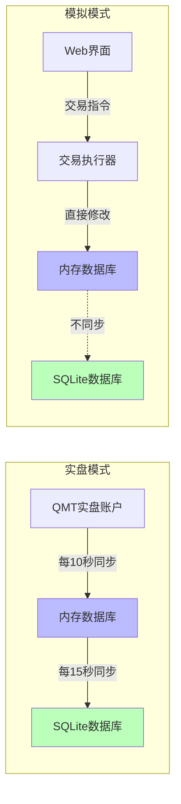
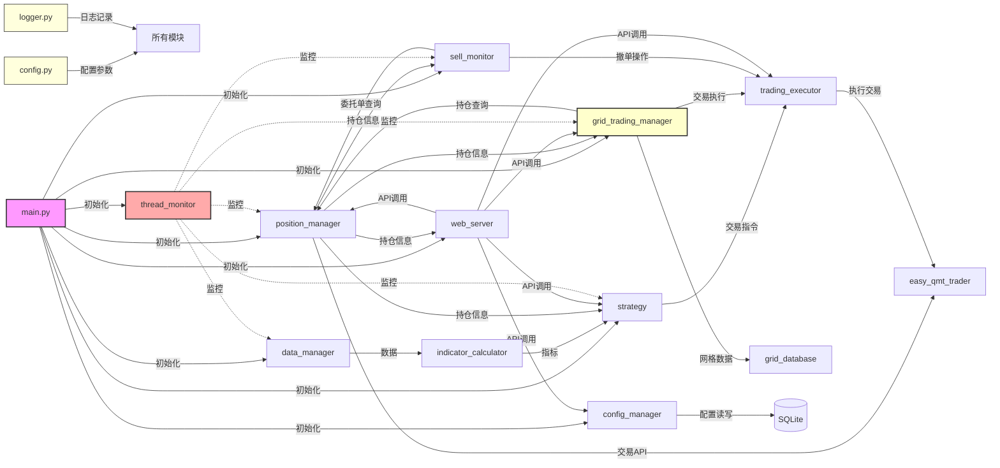
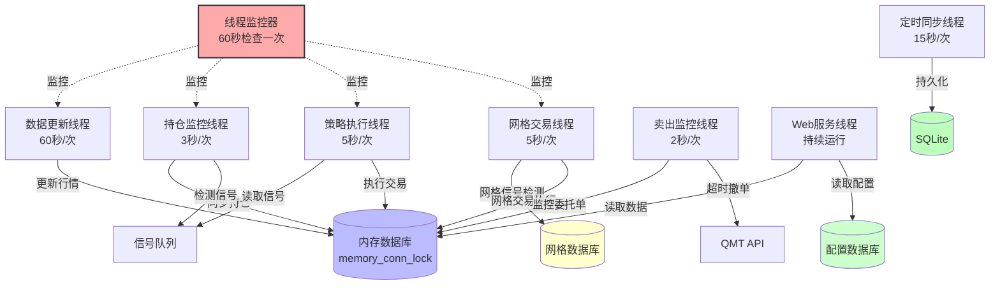
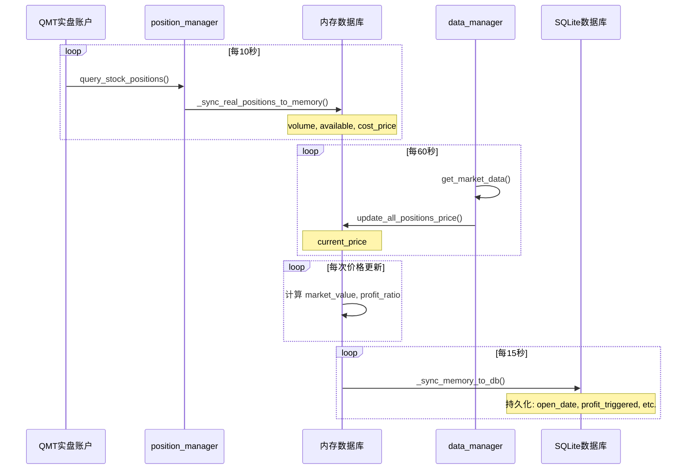
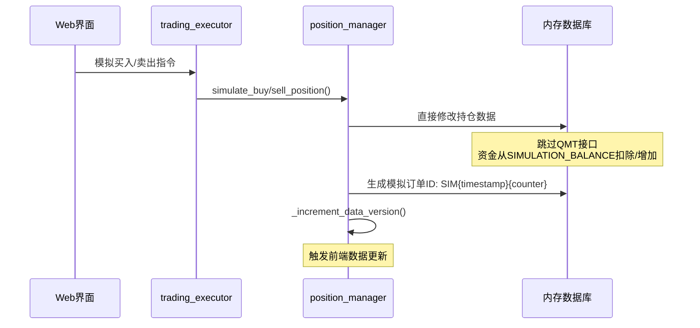
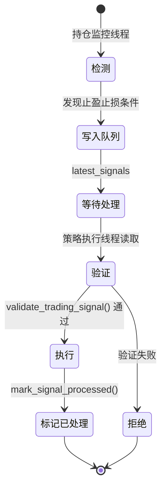
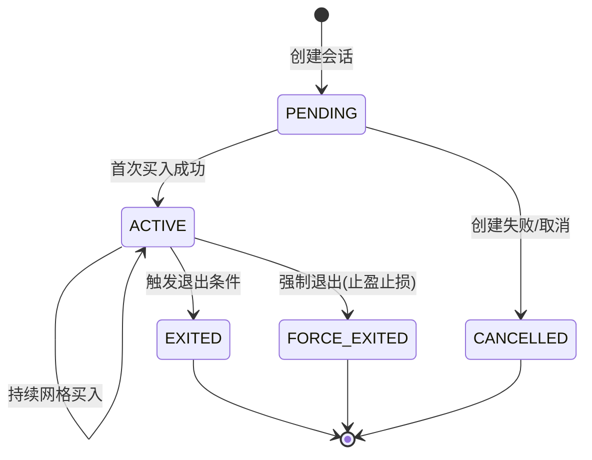
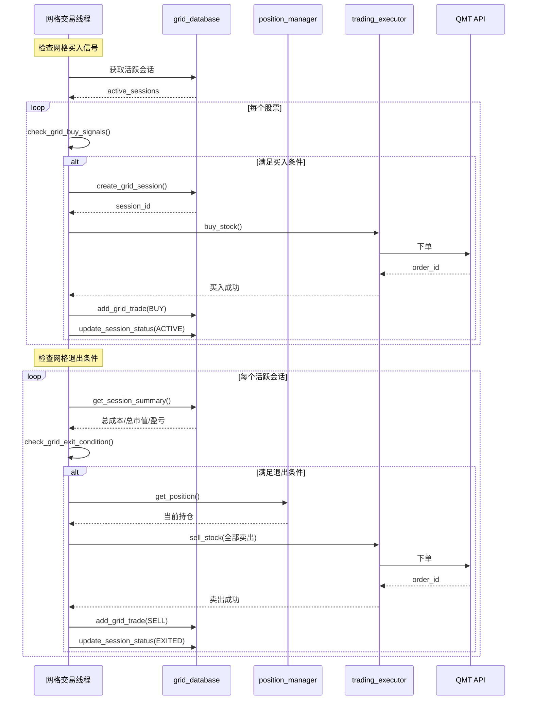

# miniQMT 系统架构文档

本文档详细说明 miniQMT 量化交易系统的架构设计、模块关系和数据流。

---

## 目录

- [整体架构](#整体架构)
- [模块设计](#模块设计)
- [线程架构](#线程架构)
- [数据流设计](#数据流设计)
- [信号处理机制](#信号处理机制)
- [网格交易架构](#网格交易架构)
- [数据库设计](#数据库设计)
- [性能优化](#性能优化)

---

## 整体架构

### 架构图



### 核心设计原则

#### 1. 信号检测与执行分离



**关键点**:
- 监控线程**始终运行**,持续检测信号
- `ENABLE_AUTO_TRADING` 只控制是否执行
- 信号验证防止重复执行

#### 2. 双层存储架构



**数据分类**:
- **高频更新数据** (存储在内存): `current_price`, `market_value`, `profit_ratio`
- **持久化数据** (同步到SQLite): `open_date`, `profit_triggered`, `highest_price`, `stop_loss_price`

---

## 模块设计

### 模块依赖关系



### 模块职责详解

| 模块 | 职责 | 关键函数 | 依赖 |
|------|------|---------|------|
| **config.py** | 集中配置管理 | `get_account_config()` | 无 |
| **logger.py** | 统一日志管理 | `get_logger()`, `clean_old_logs()` | 无 |
| **main.py** | 系统启动入口 | `main()`, `cleanup()` | 所有模块 |
| **thread_monitor.py** | 线程健康监控 | `register_thread()`, `start()` | logger, config |
| **data_manager.py** | 历史数据获取 | `get_market_data()`, `start_data_update_thread()` | xtquant.xtdata |
| **indicator_calculator.py** | 技术指标计算 | `calculate_macd()`, `calculate_ma()` | data_manager |
| **position_manager.py** | 持仓管理核心 | `get_all_positions()`, `validate_trading_signal()` | easy_qmt_trader, SQLite |
| **trading_executor.py** | 交易执行器 | `buy_stock()`, `sell_stock()` | easy_qmt_trader |
| **strategy.py** | 交易策略逻辑 | `execute_trading_signal_direct()` | position_manager, trading_executor |
| **web_server.py** | RESTful API服务 | Flask路由 | position_manager, strategy |
| **easy_qmt_trader.py** | QMT API封装 | `order_stock()`, `query_stock_positions()` | xtquant.xttrader |
| **grid_trading_manager.py** | 网格交易管理 | `check_grid_buy_signals()`, `check_grid_exit_condition()` | grid_database, position_manager |
| **grid_database.py** | 网格数据持久化 | `create_grid_session()`, `add_grid_trade()` | SQLite |
| **config_manager.py** | 配置持久化管理 | `save_config()`, `load_config()`, `update_config()` | SQLite |
| **sell_monitor.py** | 卖出监控线程 | `check_pending_sell_orders()`, `cancel_expired_orders()` | position_manager, trading_executor |

---

## 线程架构

### 线程关系图



### 线程详细说明

#### 1. 线程监控器 (thread_monitor.py)

**职责**: 检测线程崩溃并自动重启

**工作流程**:
```python
while not stop_flag:
    time.sleep(60)  # 每60秒检查一次

    for thread_name, thread_info in monitored_threads.items():
        thread = thread_info['thread_getter']()  # 使用lambda获取最新对象

        if not thread or not thread.is_alive():
            logger.error(f"检测到 {thread_name} 线程已停止")

            # 检查冷却时间(防止重启风暴)
            if time.time() - last_restart_time > 60:
                restart_func()  # 重启线程
                last_restart_time = time.time()
```

**关键配置**:
- `ENABLE_THREAD_MONITOR`: 启用/禁用线程监控
- `THREAD_CHECK_INTERVAL`: 检查间隔(默认60秒)
- `THREAD_RESTART_COOLDOWN`: 重启冷却时间(默认60秒)

#### 2. 持仓监控线程 (position_manager.py)

**职责**: 同步实盘持仓、更新价格、检测止盈止损信号

**工作流程**:
```python
while not stop_flag:
    # 非交易时段立即跳过
    if not is_trade_time():
        time.sleep(60)
        continue

    # 同步QMT持仓(每10秒一次)
    if time.time() - last_sync_time > 10:
        sync_real_positions_to_memory()

    # 更新当前价格
    update_all_positions_price()

    # 检测止盈止损信号
    for position in get_all_positions():
        signal = check_stop_loss_take_profit(position)
        if signal:
            latest_signals[stock_code] = signal

    time.sleep(3)  # 每3秒循环一次
```

**超时保护**:
```python
try:
    future = executor.submit(update_all_positions_highest_price)
    future.result(timeout=3.0)  # 3秒超时
except TimeoutError:
    logger.warning("API调用超时,跳过本次更新")
```

#### 3. 策略执行线程 (strategy.py)

**职责**: 获取待处理信号、执行交易决策

**工作流程**:
```python
while not stop_flag:
    if not ENABLE_AUTO_TRADING:
        time.sleep(5)
        continue

    # 获取待处理信号
    pending_signals = get_pending_signals()

    for stock_code, signal in pending_signals.items():
        # 验证信号
        if validate_trading_signal(stock_code, signal):
            # 执行交易
            execute_trading_signal_direct(stock_code, signal)
            # 标记已处理
            mark_signal_processed(stock_code)

    time.sleep(5)
```

#### 4. 网格交易线程 (grid_trading_manager.py)

**职责**: 检测网格买入/退出信号、执行网格交易

**工作流程**:
```python
while not stop_flag:
    if not ENABLE_GRID_TRADING:
        time.sleep(5)
        continue

    # 检查网格买入信号
    for stock_code in stock_pool:
        signal = check_grid_buy_signals(stock_code)
        if signal:
            execute_grid_buy(stock_code, signal)

    # 检查网格退出条件
    active_sessions = get_active_grid_sessions()
    for session in active_sessions:
        if check_grid_exit_condition(session):
            execute_grid_exit(session)

    time.sleep(5)
```

**关键配置**:
- `ENABLE_GRID_TRADING`: 启用/禁用网格交易
- `GRID_BUY_INTERVAL`: 网格买入间隔时间(秒)
- `GRID_MAX_POSITIONS`: 单只股票最大网格持仓数

#### 5. 卖出监控线程 (sell_monitor.py)

**职责**: 监控待成交的卖出委托单、超时撤单

**工作流程**:
```python
while not stop_flag:
    if not is_trade_time():
        time.sleep(60)
        continue

    # 检查待成交委托单
    pending_orders = get_pending_sell_orders()

    for order_id, order_info in pending_orders.items():
        # 检查是否超时(默认30秒)
        if time.time() - order_info['create_time'] > SELL_ORDER_TIMEOUT:
            # 撤销委托单
            cancel_order(order_id)
            logger.warning(f"卖出委托单超时撤销: {order_id}")

    time.sleep(2)  # 每2秒检查一次
```

**关键配置**:
- `SELL_ORDER_TIMEOUT`: 委托单超时时间(默认30秒)
- `ENABLE_SELL_MONITOR`: 启用/禁用卖出监控

#### 6. 定时同步线程 (position_manager.py)

**职责**: 将内存数据库的关键字段同步到SQLite

**工作流程**:
```python
while not stop_flag:
    time.sleep(15)  # 每15秒同步一次

    # 同步持久化字段
    for position in get_all_positions():
        cursor.execute("""
            UPDATE positions
            SET open_date=?, profit_triggered=?,
                highest_price=?, stop_loss_price=?
            WHERE stock_code=?
        """, (open_date, profit_triggered, highest_price,
              stop_loss_price, stock_code))

    conn.commit()
```

---

## 数据流设计

### 实盘模式数据流



### 模拟模式数据流



### 数据版本控制机制

```python
class PositionManager:
    def __init__(self):
        self.data_version = 0
        self.version_lock = threading.Lock()

    def _increment_data_version(self):
        """增加数据版本号,触发前端更新"""
        with self.version_lock:
            self.data_version += 1

    def get_all_positions(self):
        """返回持仓数据和版本号"""
        return {
            'positions': self._get_positions_from_memory(),
            'version': self.data_version
        }
```

**前端轮询机制**:
```javascript
let lastVersion = 0;

setInterval(() => {
    fetch('/api/positions')
        .then(res => res.json())
        .then(data => {
            if (data.version > lastVersion) {
                updateUI(data.positions);
                lastVersion = data.version;
            }
        });
}, 1000);  // 每秒检查一次
```

---

## 信号处理机制

### 信号生命周期



### 信号验证逻辑

```python
def validate_trading_signal(self, stock_code, signal_type, signal_info):
    """验证交易信号是否仍然有效

    验证项:
    1. 持仓数据一致性
    2. 信号是否过期
    3. 是否已处理(防重复)
    4. 持仓数量是否充足
    """
    # 1. 获取最新持仓
    position = self.get_position(stock_code)
    if not position or position['volume'] <= 0:
        logger.warning(f"持仓已清空,拒绝执行信号: {stock_code}")
        return False

    # 2. 检查信号时间戳
    signal_time = signal_info.get('timestamp', 0)
    if time.time() - signal_time > 60:  # 信号超过60秒视为过期
        logger.warning(f"信号已过期,拒绝执行: {stock_code}")
        return False

    # 3. 检查是否已处理
    if stock_code in self.processed_signals:
        last_process_time = self.processed_signals[stock_code]
        if time.time() - last_process_time < 300:  # 5分钟内不重复执行
            logger.warning(f"信号已处理,拒绝重复执行: {stock_code}")
            return False

    # 4. 验证持仓数量
    required_volume = signal_info.get('volume', 0)
    if position['available'] < required_volume:
        logger.warning(f"可用数量不足,拒绝执行: {stock_code}")
        return False

    return True
```

### 信号类型

| 信号类型 | 触发条件 | 执行动作 | 优先级 | 数据来源 |
|---------|---------|---------|--------|---------|
| **止损** | `profit_ratio <= STOP_LOSS_RATIO` | 全仓卖出 | 最高 | 持仓监控线程 |
| **首次止盈** | `profit_ratio >= INITIAL_TAKE_PROFIT_RATIO` | 卖出60% | 高 | 持仓监控线程 |
| **动态止盈** | `current_price <= 动态止盈位` | 全仓卖出 | 中 | 持仓监控线程 |
| **网格买入** | `price <= 网格触发价` | 按配额买入 | 低 | 网格交易线程 |
| **网格退出** | 满足止盈/止损/超时条件 | 清空网格持仓 | 中 | 网格交易线程 |

### 信号冲突处理

**优先级规则**:
1. 止盈止损信号优先于网格信号
2. 同一股票同时触发多个信号时,按优先级顺序执行
3. 网格交易中若触发止盈止损,立即退出网格会话

**实现逻辑**:
```python
def process_signals(stock_code):
    # 1. 检查止盈止损信号
    stop_signal = check_stop_loss_take_profit(stock_code)
    if stop_signal:
        # 优先处理止盈止损,取消网格信号
        if has_active_grid_session(stock_code):
            force_exit_grid_session(stock_code, reason="触发止盈止损")
        execute_stop_signal(stop_signal)
        return

    # 2. 检查网格信号
    if ENABLE_GRID_TRADING:
        grid_signal = check_grid_signals(stock_code)
        if grid_signal:
            execute_grid_signal(grid_signal)
```

---

## 网格交易架构

### 核心数据模型

网格交易系统基于会话(Session)管理,每个会话代表一只股票的完整网格交易周期。

#### 网格会话生命周期



**会话状态说明**:
- `PENDING`: 等待首次买入
- `ACTIVE`: 活跃交易中
- `EXITED`: 正常退出(达到止盈/止损/超时)
- `FORCE_EXITED`: 强制退出(触发止盈止损策略)
- `CANCELLED`: 已取消

### 网格交易工作流程



### 网格退出条件

网格会话在以下任一条件满足时退出:

| 条件 | 公式 | 默认值 | 说明 |
|------|------|--------|------|
| **止盈** | `total_profit_ratio >= GRID_TAKE_PROFIT_RATIO` | 8% | 总盈利比例达到目标 |
| **止损** | `total_profit_ratio <= GRID_STOP_LOSS_RATIO` | -10% | 总亏损比例超过阈值 |
| **超时** | `duration >= GRID_MAX_HOLD_DAYS` | 30天 | 持有时间过长 |

**强制退出**: 当普通持仓触发止盈止损策略时,同股票的网格会话立即强制退出。

### 网格盈亏计算

#### 单笔交易盈亏

```python
# 买入成本
buy_cost = buy_price * volume + commission

# 卖出收益
sell_revenue = sell_price * volume - commission

# 单笔盈亏
single_profit = sell_revenue - buy_cost
```

#### 会话总盈亏

```python
# 总买入成本
total_cost = sum([trade.price * trade.volume for trade in buy_trades])

# 已卖出收益
sold_revenue = sum([trade.price * trade.volume for trade in sell_trades])

# 持仓市值
holding_value = current_price * holding_volume

# 总盈亏
total_profit = sold_revenue + holding_value - total_cost

# 盈亏比例
total_profit_ratio = total_profit / total_cost
```

### 网格买入策略

**触发条件**:
1. 当前无活跃网格会话或距上次买入超过 `GRID_BUY_INTERVAL` 秒
2. 当前价格低于上次买入价格的 `(1 - GRID_PRICE_DROP_THRESHOLD)`
3. 未达到最大持仓数 `GRID_MAX_POSITIONS`

**买入金额**:
- 每次买入固定金额 `GRID_BUY_AMOUNT` (默认5000元)
- 不足100股则向上取整到100的倍数

**示例配置**:
```python
GRID_BUY_AMOUNT = 5000          # 每次买入5000元
GRID_PRICE_DROP_THRESHOLD = 0.02  # 价格下跌2%触发买入
GRID_BUY_INTERVAL = 300         # 两次买入间隔至少5分钟
GRID_MAX_POSITIONS = 10         # 单只股票最多10个网格位
```

### 线程安全保护

网格数据库操作使用独立锁保护:

```python
class GridDatabase:
    def __init__(self):
        self.db_lock = threading.Lock()

    def create_grid_session(self, ...):
        with self.db_lock:
            cursor.execute("INSERT INTO grid_sessions ...")
            conn.commit()
```

内存数据库操作使用 `memory_conn_lock`:

```python
# position_manager.py
with self.memory_conn_lock:
    cursor.execute("UPDATE positions SET ...")
    memory_conn.commit()
```

---

## 数据库设计

### 表结构

#### positions (持仓表)

```sql
CREATE TABLE positions (
    stock_code TEXT PRIMARY KEY,       -- 股票代码
    stock_name TEXT,                   -- 股票名称
    volume REAL,                       -- 持仓数量(来自QMT)
    available REAL,                    -- 可用数量(来自QMT)
    cost_price REAL,                   -- 成本价(来自QMT)
    base_cost_price REAL,              -- 基础成本价
    current_price REAL,                -- 当前价(来自行情接口)
    market_value REAL,                 -- 市值(计算得出)
    profit_ratio REAL,                 -- 盈亏比例(计算得出)
    last_update TIMESTAMP,             -- 最后更新时间
    open_date TIMESTAMP,               -- 开仓日期(持久化)
    profit_triggered BOOLEAN,          -- 是否触发首次止盈(持久化)
    highest_price REAL,                -- 历史最高价(持久化)
    stop_loss_price REAL,              -- 止损价(持久化)
    profit_breakout_triggered BOOLEAN, -- 是否触发突破止盈(持久化)
    breakout_highest_price REAL        -- 突破后最高价(持久化)
)
```

**字段说明**:
- **来自QMT实盘**: `stock_code`, `volume`, `available`, `cost_price` (每10秒同步)
- **来自行情接口**: `current_price` (实时更新)
- **计算得出**: `market_value`, `profit_ratio` (价格更新时重新计算)
- **持久化字段**: `open_date`, `profit_triggered`, `highest_price`, `stop_loss_price`, `profit_breakout_triggered`, `breakout_highest_price` (策略触发时更新并立即同步到SQLite)

#### trade_records (交易记录表)

```sql
CREATE TABLE trade_records (
    id INTEGER PRIMARY KEY AUTOINCREMENT,
    stock_code TEXT,                   -- 股票代码
    stock_name TEXT,                   -- 股票名称
    trade_time TIMESTAMP,              -- 交易时间
    trade_type TEXT,                   -- BUY, SELL
    price REAL,                        -- 交易价格
    volume INTEGER,                    -- 交易数量
    amount REAL,                       -- 交易金额
    trade_id TEXT,                     -- 订单ID
    commission REAL,                   -- 手续费
    strategy TEXT                      -- 策略标识(simu/auto_partial/stop_loss/grid等)
)
```

**trade_id格式**:
- 实盘: QMT API返回的真实订单号
- 模拟: `SIM{timestamp}{counter}` (例: `SIM170123456789001`)

#### stock_daily_data (历史K线数据表)

```sql
CREATE TABLE stock_daily_data (
    stock_code TEXT,
    stock_name TEXT,
    date TEXT,
    open REAL,
    high REAL,
    low REAL,
    close REAL,
    volume REAL,
    amount REAL,
    PRIMARY KEY (stock_code, date)
)
```

#### grid_sessions (网格会话表)

```sql
CREATE TABLE grid_sessions (
    session_id INTEGER PRIMARY KEY AUTOINCREMENT,
    stock_code TEXT NOT NULL,              -- 股票代码
    stock_name TEXT,                       -- 股票名称
    status TEXT DEFAULT 'PENDING',         -- 会话状态: PENDING/ACTIVE/EXITED/FORCE_EXITED/CANCELLED
    create_time TIMESTAMP DEFAULT CURRENT_TIMESTAMP,  -- 创建时间
    update_time TIMESTAMP,                 -- 最后更新时间
    exit_time TIMESTAMP,                   -- 退出时间
    exit_reason TEXT,                      -- 退出原因
    initial_price REAL,                    -- 首次买入价格
    total_buy_volume INTEGER DEFAULT 0,    -- 累计买入数量
    total_buy_amount REAL DEFAULT 0,       -- 累计买入金额
    total_sell_volume INTEGER DEFAULT 0,   -- 累计卖出数量
    total_sell_amount REAL DEFAULT 0,      -- 累计卖出金额
    realized_profit REAL DEFAULT 0,        -- 已实现盈亏
    config_snapshot TEXT                   -- 创建时的配置快照(JSON)
)
```

**状态转换**:

| 当前状态 | 触发事件 | 下一状态 |
|---------|---------|---------|
| PENDING | 首次买入成功 | ACTIVE |
| PENDING | 创建失败/手动取消 | CANCELLED |
| ACTIVE | 达到止盈/止损/超时条件 | EXITED |
| ACTIVE | 持仓触发止盈止损策略 | FORCE_EXITED |

#### grid_trades (网格交易记录表)

```sql
CREATE TABLE grid_trades (
    trade_id INTEGER PRIMARY KEY AUTOINCREMENT,
    session_id INTEGER NOT NULL,           -- 所属会话ID
    stock_code TEXT NOT NULL,              -- 股票代码
    trade_type TEXT NOT NULL,             -- BUY / SELL
    price REAL NOT NULL,                  -- 成交价格
    volume INTEGER NOT NULL,              -- 成交数量
    amount REAL NOT NULL,                 -- 成交金额
    commission REAL DEFAULT 0,            -- 手续费
    order_id TEXT,                        -- QMT订单ID
    trade_time TIMESTAMP DEFAULT CURRENT_TIMESTAMP,  -- 成交时间
    grid_level INTEGER,                   -- 网格层级(第几次买入)
    note TEXT,                            -- 备注
    FOREIGN KEY (session_id) REFERENCES grid_sessions(session_id)
)
```

**trade_type 说明**:
- `BUY`: 网格买入
- `SELL`: 网格卖出(退出)

#### system_config (系统配置表)

```sql
CREATE TABLE system_config (
    config_key TEXT PRIMARY KEY,          -- 配置键名
    config_value TEXT,                    -- 配置值(JSON序列化)
    config_type TEXT,                     -- 数据类型: string/int/float/bool/json
    description TEXT,                     -- 配置说明
    update_time TIMESTAMP DEFAULT CURRENT_TIMESTAMP,  -- 最后更新时间
    updated_by TEXT DEFAULT 'system'      -- 更新来源
)
```

**用途**: 支持通过 Web API 动态更新配置,无需重启系统。

**常用配置键**:
```
ENABLE_AUTO_TRADING        -- 自动交易开关
ENABLE_GRID_TRADING        -- 网格交易开关
STOP_LOSS_RATIO            -- 止损比例
INITIAL_TAKE_PROFIT_RATIO  -- 首次止盈比例
GRID_BUY_AMOUNT            -- 网格买入金额
```

#### config_history (配置历史表)

```sql
CREATE TABLE config_history (
    id INTEGER PRIMARY KEY AUTOINCREMENT,
    config_key TEXT NOT NULL,             -- 配置键名
    old_value TEXT,                       -- 修改前的值
    new_value TEXT,                       -- 修改后的值
    change_time TIMESTAMP DEFAULT CURRENT_TIMESTAMP,  -- 修改时间
    changed_by TEXT,                      -- 修改来源(web_api/system)
    change_reason TEXT                    -- 修改原因
)
```

**用途**: 记录所有配置变更历史,支持审计和回滚。

---

## 性能优化

### 1. 查询频率优化

**优化前**:
```python
# QMT持仓查询: 每3秒一次
# SQLite同步: 每5秒一次
# CPU占用: 非交易时段 ~30%
```

**优化后**:
```python
# QMT持仓查询: 每10秒一次 (↓70% API调用)
QMT_POSITION_QUERY_INTERVAL = 10.0

# SQLite同步: 每15秒一次 (↓67% I/O操作)
POSITION_SYNC_INTERVAL = 15.0

# 非交易时段立即跳过
if not is_trade_time():
    time.sleep(60)
    continue

# CPU占用: 非交易时段 <2% (↓93%)
```

### 2. 超时保护

```python
from concurrent.futures import ThreadPoolExecutor, TimeoutError

executor = ThreadPoolExecutor(max_workers=1)

try:
    future = executor.submit(expensive_api_call)
    result = future.result(timeout=3.0)  # 3秒超时
except TimeoutError:
    logger.warning("API调用超时,跳过本次更新")
    # 继续执行,不阻塞循环
```

### 3. 缓存机制

```python
CACHE_CONFIG = {
    'positions_ttl': 5.0,      # 持仓数据缓存5秒
    'quotes_ttl': 3.0,         # 行情数据缓存3秒
    'max_cache_size': 100
}

class DataCache:
    def __init__(self):
        self.cache = {}
        self.cache_time = {}

    def get(self, key, ttl):
        if key in self.cache:
            if time.time() - self.cache_time[key] < ttl:
                return self.cache[key]
        return None

    def set(self, key, value):
        self.cache[key] = value
        self.cache_time[key] = time.time()
```

### 4. HTTP版本号机制

**前端只在版本号变化时更新UI**:
```javascript
// 减少无效数据传输
if (data.version > lastVersion) {
    updateUI(data.positions);  // 仅在数据变化时更新
    lastVersion = data.version;
}
```

### 5. 数据库索引

```sql
-- 为高频查询字段添加索引
CREATE INDEX idx_positions_code ON positions(stock_code);
CREATE INDEX idx_trade_records_time ON trade_records(trade_time);
CREATE INDEX idx_trade_records_code ON trade_records(stock_code);
CREATE INDEX idx_grid_sessions_code ON grid_sessions(stock_code);
CREATE INDEX idx_grid_sessions_status ON grid_sessions(status);
CREATE INDEX idx_grid_trades_session ON grid_trades(session_id);
CREATE INDEX idx_config_history_key ON config_history(config_key);
```

### 6. 内存数据库并发优化

**问题**: 多线程并发访问内存数据库导致 `sqlite3.OperationalError: database is locked`

**解决方案**: 为所有内存数据库操作添加 `memory_conn_lock` 保护

```python
class PositionManager:
    def __init__(self):
        self.memory_conn_lock = threading.Lock()  # 内存数据库锁

    def update_position_price(self, stock_code, current_price):
        """更新持仓价格(加锁保护)"""
        with self.memory_conn_lock:
            cursor = self.memory_conn.cursor()
            cursor.execute("""
                UPDATE positions
                SET current_price=?, market_value=?, profit_ratio=?
                WHERE stock_code=?
            """, (current_price, market_value, profit_ratio, stock_code))
            self.memory_conn.commit()
```

**修复范围**: 在 `position_manager.py` 中16处内存数据库操作均已加锁保护。

### 7. data_manager 数据插入优化

**问题**: `REPLACE INTO` 使用 numpy 类型参数导致 SQLite 绑定错误

```python
# ❌ 错误: numpy.float64 无法正确绑定
cursor.execute("REPLACE INTO stock_daily_data VALUES (?,?,?,?,?,?,?,?,?)",
               (stock_code, stock_name, date,
                df['open'][i],    # numpy.float64
                df['high'][i],    # numpy.float64
                ...))
```

**解决方案**: 转换为 Python 原生类型

```python
# ✅ 正确: 转换为 float
cursor.execute("REPLACE INTO stock_daily_data VALUES (?,?,?,?,?,?,?,?,?)",
               (stock_code, stock_name, date,
                float(df['open'].iloc[i]),
                float(df['high'].iloc[i]),
                float(df['low'].iloc[i]),
                float(df['close'].iloc[i]),
                float(df['volume'].iloc[i]),
                float(df['amount'].iloc[i])))
```

**效果**: 消除数据插入时的类型错误,提升数据同步稳定性。

### 8. 日志优化配置

**问题**: 大量DEBUG日志影响性能和可读性

**优化策略**:

```python
# config.py - 生产环境配置
LOG_LEVEL = "INFO"  # 仅记录INFO及以上级别
DEBUG = False       # 关闭调试模式

# 关键路径使用DEBUG,正常路径使用INFO
logger.debug(f"循环 #{loop_count}: 当前价格 {current_price}")  # 高频日志
logger.info(f"检测到止盈信号: {stock_code}")  # 关键事件
```

**日志文件管理**:
- 自动按天切分: `qmt_trading_YYYYMMDD.log`
- 保留最近7天日志
- 超过10MB自动轮转

---

## 附录

### A. 关键配置参数

#### 系统开关

| 配置项 | 默认值 | 说明 |
|-------|--------|------|
| `ENABLE_SIMULATION_MODE` | `True` | 模拟/实盘切换 |
| `ENABLE_AUTO_TRADING` | `False` | 自动交易执行开关 |
| `ENABLE_THREAD_MONITOR` | `True` | 线程健康监控 |
| `ENABLE_GRID_TRADING` | `False` | 网格交易功能开关 |
| `ENABLE_SELL_MONITOR` | `False` | 卖出监控功能开关 |
| `DEBUG` | `False` | 调试模式 |

#### 线程相关

| 配置项 | 默认值 | 说明 |
|-------|--------|------|
| `MONITOR_LOOP_INTERVAL` | `3` | 持仓监控循环间隔(秒) |
| `MONITOR_CALL_TIMEOUT` | `3.0` | API调用超时(秒) |
| `QMT_POSITION_QUERY_INTERVAL` | `10.0` | QMT持仓查询间隔(秒) |
| `POSITION_SYNC_INTERVAL` | `15.0` | SQLite同步间隔(秒) |
| `THREAD_CHECK_INTERVAL` | `60` | 线程监控检查间隔(秒) |
| `THREAD_RESTART_COOLDOWN` | `60` | 线程重启冷却时间(秒) |

#### 止盈止损

| 配置项 | 默认值 | 说明 |
|-------|--------|------|
| `STOP_LOSS_RATIO` | `-0.075` | 止损比例(-7.5%) |
| `INITIAL_TAKE_PROFIT_RATIO` | `0.06` | 首次止盈比例(6%) |
| `INITIAL_TAKE_PROFIT_RATIO_PERCENTAGE` | `0.6` | 首次止盈卖出比例(60%) |
| `DYNAMIC_TAKE_PROFIT` | `[(0.05, 0.96), ...]` | 动态止盈阶梯 |

#### 网格交易

| 配置项 | 默认值 | 说明 |
|-------|--------|------|
| `GRID_BUY_AMOUNT` | `5000` | 每次网格买入金额(元) |
| `GRID_PRICE_DROP_THRESHOLD` | `0.02` | 价格下跌阈值(2%) |
| `GRID_BUY_INTERVAL` | `300` | 两次买入最小间隔(秒) |
| `GRID_MAX_POSITIONS` | `10` | 单只股票最大网格持仓数 |
| `GRID_TAKE_PROFIT_RATIO` | `0.08` | 网格止盈比例(8%) |
| `GRID_STOP_LOSS_RATIO` | `-0.10` | 网格止损比例(-10%) |
| `GRID_MAX_HOLD_DAYS` | `30` | 网格最大持有天数 |

#### 委托单管理

| 配置项 | 默认值 | 说明 |
|-------|--------|------|
| `SELL_ORDER_TIMEOUT` | `30` | 卖出委托单超时时间(秒) |
| `ORDER_CHECK_INTERVAL` | `2` | 委托单检查间隔(秒) |
| `MAX_CANCEL_RETRIES` | `3` | 撤单最大重试次数 |

### B. 线程启动顺序

1. **main.py** 启动
2. **data_manager** 初始化并启动数据更新线程
3. **position_manager** 初始化并启动持仓监控线程、定时同步线程
4. **strategy** 初始化并启动策略执行线程
5. **grid_trading_manager** 初始化并启动网格交易线程(如果 `ENABLE_GRID_TRADING=True`)
6. **sell_monitor** 初始化并启动卖出监控线程(如果 `ENABLE_SELL_MONITOR=True`)
7. **web_server** 启动Web服务
8. **thread_monitor** 启动线程监控器(最后启动,监控其他线程)

### C. 优雅关闭顺序

1. **Web服务器** → 停止接收新请求
2. **线程监控器** → 停止监控循环,避免误触发重启
3. **业务线程** → 停止数据更新、持仓监控、策略执行、网格交易、卖出监控
4. **核心模块** → 按依赖顺序关闭(策略→执行器→数据管理器/数据库)
5. **数据库连接** → 关闭内存数据库和SQLite连接

**关键要点**:
- 每个关闭步骤都有独立的异常处理
- 单个步骤失败不影响其他资源清理
- 线程监控器必须先于业务线程关闭
- 详见 [优雅关闭优化文档](docs/graceful_shutdown_optimization.md)

---

**文档版本**: v1.1
**最后更新**: 2026-02-17
**维护者**: miniQMT Team
