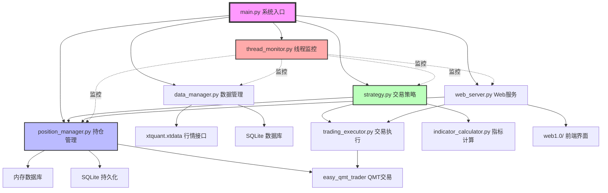
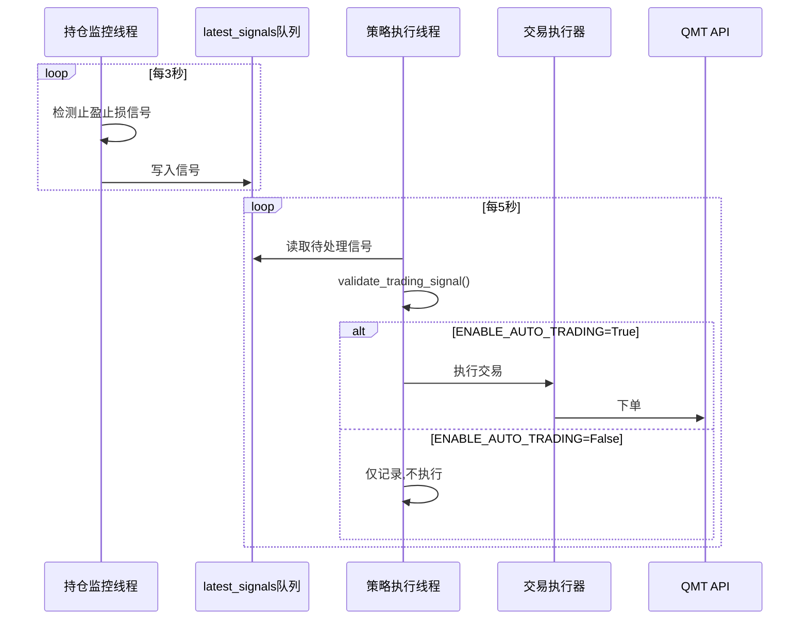
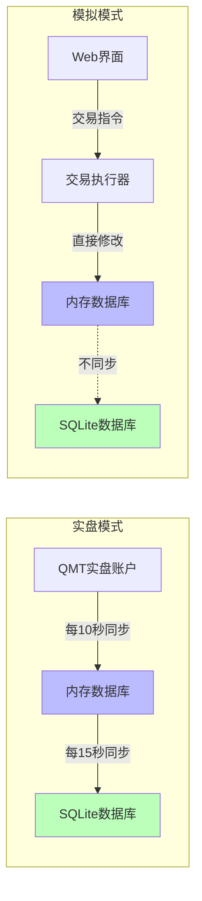
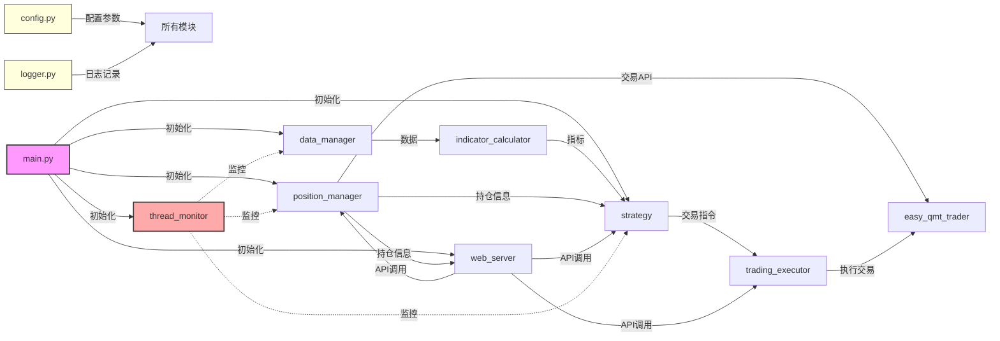
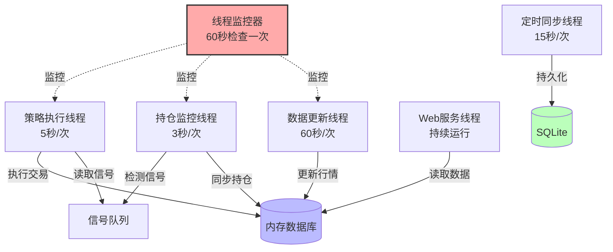
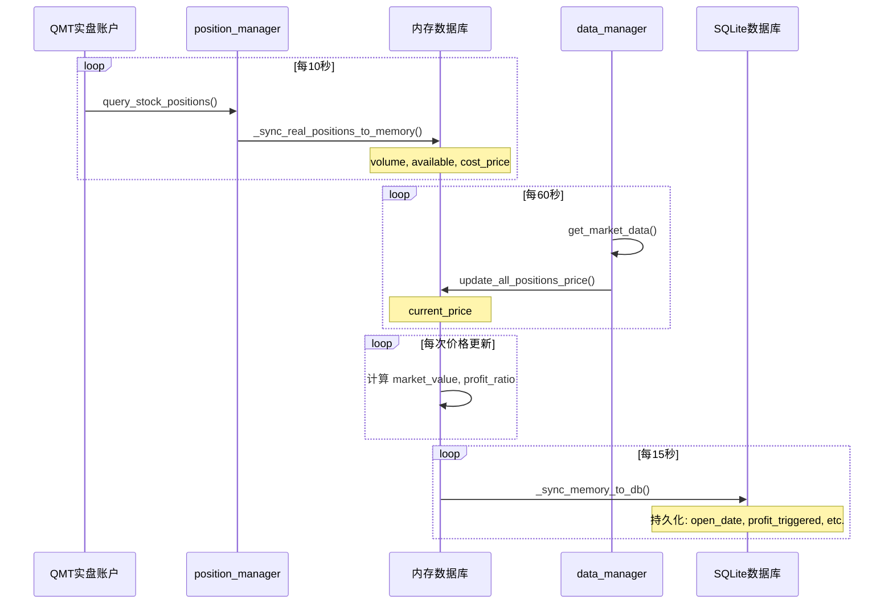
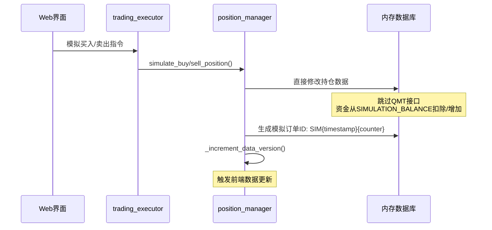
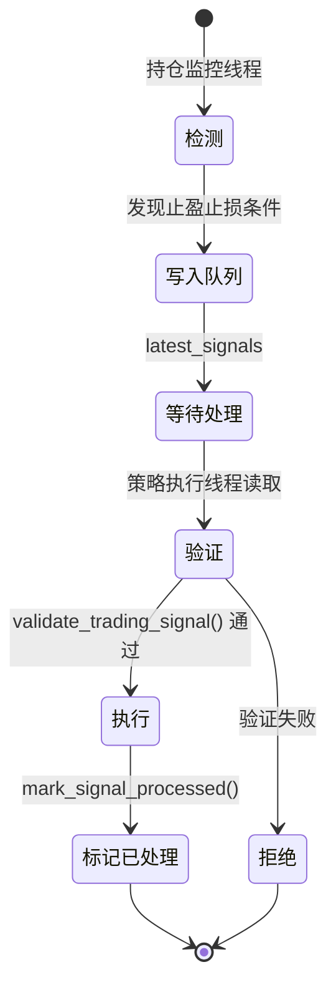

# miniQMT 系统架构文档

本文档详细说明 miniQMT 量化交易系统的架构设计、模块关系和数据流。

---

## 目录

- [整体架构](#整体架构)
- [模块设计](#模块设计)
- [线程架构](#线程架构)
- [数据流设计](#数据流设计)
- [信号处理机制](#信号处理机制)
- [数据库设计](#数据库设计)
- [性能优化](#性能优化)

---

## 整体架构

### 架构图



### 核心设计原则

#### 1. 信号检测与执行分离



**关键点**:
- 监控线程**始终运行**,持续检测信号
- `ENABLE_AUTO_TRADING` 只控制是否执行
- 信号验证防止重复执行

#### 2. 双层存储架构



**数据分类**:
- **高频更新数据** (存储在内存): `current_price`, `market_value`, `profit_ratio`
- **持久化数据** (同步到SQLite): `open_date`, `profit_triggered`, `highest_price`, `stop_loss_price`

---

## 模块设计

### 模块依赖关系



### 模块职责详解

| 模块 | 职责 | 关键函数 | 依赖 |
|------|------|---------|------|
| **config.py** | 集中配置管理 | `get_account_config()` | 无 |
| **logger.py** | 统一日志管理 | `get_logger()`, `clean_old_logs()` | 无 |
| **main.py** | 系统启动入口 | `main()`, `cleanup()` | 所有模块 |
| **thread_monitor.py** | 线程健康监控 | `register_thread()`, `start()` | logger, config |
| **data_manager.py** | 历史数据获取 | `get_market_data()`, `start_data_update_thread()` | xtquant.xtdata |
| **indicator_calculator.py** | 技术指标计算 | `calculate_macd()`, `calculate_ma()` | data_manager |
| **position_manager.py** | 持仓管理核心 | `get_all_positions()`, `validate_trading_signal()` | easy_qmt_trader, SQLite |
| **trading_executor.py** | 交易执行器 | `buy_stock()`, `sell_stock()` | easy_qmt_trader |
| **strategy.py** | 交易策略逻辑 | `execute_trading_signal_direct()` | position_manager, trading_executor |
| **web_server.py** | RESTful API服务 | Flask路由 | position_manager, strategy |
| **easy_qmt_trader.py** | QMT API封装 | `order_stock()`, `query_stock_positions()` | xtquant.xttrader |

---

## 线程架构

### 线程关系图



### 线程详细说明

#### 1. 线程监控器 (thread_monitor.py)

**职责**: 检测线程崩溃并自动重启

**工作流程**:
```python
while not stop_flag:
    time.sleep(60)  # 每60秒检查一次

    for thread_name, thread_info in monitored_threads.items():
        thread = thread_info['thread_getter']()  # 使用lambda获取最新对象

        if not thread or not thread.is_alive():
            logger.error(f"检测到 {thread_name} 线程已停止")

            # 检查冷却时间(防止重启风暴)
            if time.time() - last_restart_time > 60:
                restart_func()  # 重启线程
                last_restart_time = time.time()
```

**关键配置**:
- `ENABLE_THREAD_MONITOR`: 启用/禁用线程监控
- `THREAD_CHECK_INTERVAL`: 检查间隔(默认60秒)
- `THREAD_RESTART_COOLDOWN`: 重启冷却时间(默认60秒)

#### 2. 持仓监控线程 (position_manager.py)

**职责**: 同步实盘持仓、更新价格、检测止盈止损信号

**工作流程**:
```python
while not stop_flag:
    # 非交易时段立即跳过
    if not is_trade_time():
        time.sleep(60)
        continue

    # 同步QMT持仓(每10秒一次)
    if time.time() - last_sync_time > 10:
        sync_real_positions_to_memory()

    # 更新当前价格
    update_all_positions_price()

    # 检测止盈止损信号
    for position in get_all_positions():
        signal = check_stop_loss_take_profit(position)
        if signal:
            latest_signals[stock_code] = signal

    time.sleep(3)  # 每3秒循环一次
```

**超时保护**:
```python
try:
    future = executor.submit(update_all_positions_highest_price)
    future.result(timeout=3.0)  # 3秒超时
except TimeoutError:
    logger.warning("API调用超时,跳过本次更新")
```

#### 3. 策略执行线程 (strategy.py)

**职责**: 获取待处理信号、执行交易决策

**工作流程**:
```python
while not stop_flag:
    if not ENABLE_AUTO_TRADING:
        time.sleep(5)
        continue

    # 获取待处理信号
    pending_signals = get_pending_signals()

    for stock_code, signal in pending_signals.items():
        # 验证信号
        if validate_trading_signal(stock_code, signal):
            # 执行交易
            execute_trading_signal_direct(stock_code, signal)
            # 标记已处理
            mark_signal_processed(stock_code)

    time.sleep(5)
```

#### 4. 定时同步线程 (position_manager.py)

**职责**: 将内存数据库的关键字段同步到SQLite

**工作流程**:
```python
while not stop_flag:
    time.sleep(15)  # 每15秒同步一次

    # 同步持久化字段
    for position in get_all_positions():
        cursor.execute("""
            UPDATE positions
            SET open_date=?, profit_triggered=?,
                highest_price=?, stop_loss_price=?
            WHERE stock_code=?
        """, (open_date, profit_triggered, highest_price,
              stop_loss_price, stock_code))

    conn.commit()
```

---

## 数据流设计

### 实盘模式数据流



### 模拟模式数据流



### 数据版本控制机制

```python
class PositionManager:
    def __init__(self):
        self.data_version = 0
        self.version_lock = threading.Lock()

    def _increment_data_version(self):
        """增加数据版本号,触发前端更新"""
        with self.version_lock:
            self.data_version += 1

    def get_all_positions(self):
        """返回持仓数据和版本号"""
        return {
            'positions': self._get_positions_from_memory(),
            'version': self.data_version
        }
```

**前端轮询机制**:
```javascript
let lastVersion = 0;

setInterval(() => {
    fetch('/api/positions')
        .then(res => res.json())
        .then(data => {
            if (data.version > lastVersion) {
                updateUI(data.positions);
                lastVersion = data.version;
            }
        });
}, 1000);  // 每秒检查一次
```

---

## 信号处理机制

### 信号生命周期



### 信号验证逻辑

```python
def validate_trading_signal(self, stock_code, signal_type, signal_info):
    """验证交易信号是否仍然有效

    验证项:
    1. 持仓数据一致性
    2. 信号是否过期
    3. 是否已处理(防重复)
    4. 持仓数量是否充足
    """
    # 1. 获取最新持仓
    position = self.get_position(stock_code)
    if not position or position['volume'] <= 0:
        logger.warning(f"持仓已清空,拒绝执行信号: {stock_code}")
        return False

    # 2. 检查信号时间戳
    signal_time = signal_info.get('timestamp', 0)
    if time.time() - signal_time > 60:  # 信号超过60秒视为过期
        logger.warning(f"信号已过期,拒绝执行: {stock_code}")
        return False

    # 3. 检查是否已处理
    if stock_code in self.processed_signals:
        last_process_time = self.processed_signals[stock_code]
        if time.time() - last_process_time < 300:  # 5分钟内不重复执行
            logger.warning(f"信号已处理,拒绝重复执行: {stock_code}")
            return False

    # 4. 验证持仓数量
    required_volume = signal_info.get('volume', 0)
    if position['available'] < required_volume:
        logger.warning(f"可用数量不足,拒绝执行: {stock_code}")
        return False

    return True
```

### 信号类型

| 信号类型 | 触发条件 | 执行动作 | 优先级 |
|---------|---------|---------|--------|
| **止损** | `profit_ratio <= STOP_LOSS_RATIO` | 全仓卖出 | 最高 |
| **首次止盈** | `profit_ratio >= INITIAL_TAKE_PROFIT_RATIO` | 卖出60% | 高 |
| **动态止盈** | `current_price <= 动态止盈位` | 全仓卖出 | 中 |
| **网格补仓** | `price <= 网格价格点` | 买入 | 低 |

---

## 数据库设计

### 表结构

#### positions (持仓表)

```sql
CREATE TABLE positions (
    stock_code TEXT PRIMARY KEY,       -- 股票代码
    stock_name TEXT,                   -- 股票名称
    volume REAL,                       -- 持仓数量(来自QMT)
    available REAL,                    -- 可用数量(来自QMT)
    cost_price REAL,                   -- 成本价(来自QMT)
    base_cost_price REAL,              -- 基础成本价
    current_price REAL,                -- 当前价(来自行情接口)
    market_value REAL,                 -- 市值(计算得出)
    profit_ratio REAL,                 -- 盈亏比例(计算得出)
    last_update TIMESTAMP,             -- 最后更新时间
    open_date TIMESTAMP,               -- 开仓日期(持久化)
    profit_triggered BOOLEAN,          -- 是否触发首次止盈(持久化)
    highest_price REAL,                -- 历史最高价(持久化)
    stop_loss_price REAL,              -- 止损价(持久化)
    profit_breakout_triggered BOOLEAN, -- 是否触发突破止盈
    breakout_highest_price REAL        -- 突破后最高价
)
```

**字段说明**:
- **来自QMT实盘**: `stock_code`, `volume`, `available`, `cost_price` (每10秒同步)
- **来自行情接口**: `current_price` (实时更新)
- **计算得出**: `market_value`, `profit_ratio` (价格更新时重新计算)
- **持久化字段**: `open_date`, `profit_triggered`, `highest_price`, `stop_loss_price` (策略触发时更新并立即同步到SQLite)

#### trade_records (交易记录表)

```sql
CREATE TABLE trade_records (
    id INTEGER PRIMARY KEY AUTOINCREMENT,
    stock_code TEXT,                   -- 股票代码
    stock_name TEXT,                   -- 股票名称
    trade_time TIMESTAMP,              -- 交易时间
    trade_type TEXT,                   -- BUY, SELL
    price REAL,                        -- 交易价格
    volume INTEGER,                    -- 交易数量
    amount REAL,                       -- 交易金额
    trade_id TEXT,                     -- 订单ID
    commission REAL,                   -- 手续费
    strategy TEXT                      -- 策略标识(simu/auto_partial/stop_loss/grid等)
)
```

**trade_id格式**:
- 实盘: QMT API返回的真实订单号
- 模拟: `SIM{timestamp}{counter}` (例: `SIM170123456789001`)

#### stock_daily_data (历史K线数据表)

```sql
CREATE TABLE stock_daily_data (
    stock_code TEXT,
    stock_name TEXT,
    date TEXT,
    open REAL,
    high REAL,
    low REAL,
    close REAL,
    volume REAL,
    amount REAL,
    PRIMARY KEY (stock_code, date)
)
```

---

## 性能优化

### 1. 查询频率优化

**优化前**:
```python
# QMT持仓查询: 每3秒一次
# SQLite同步: 每5秒一次
# CPU占用: 非交易时段 ~30%
```

**优化后**:
```python
# QMT持仓查询: 每10秒一次 (↓70% API调用)
QMT_POSITION_QUERY_INTERVAL = 10.0

# SQLite同步: 每15秒一次 (↓67% I/O操作)
POSITION_SYNC_INTERVAL = 15.0

# 非交易时段立即跳过
if not is_trade_time():
    time.sleep(60)
    continue

# CPU占用: 非交易时段 <2% (↓93%)
```

### 2. 超时保护

```python
from concurrent.futures import ThreadPoolExecutor, TimeoutError

executor = ThreadPoolExecutor(max_workers=1)

try:
    future = executor.submit(expensive_api_call)
    result = future.result(timeout=3.0)  # 3秒超时
except TimeoutError:
    logger.warning("API调用超时,跳过本次更新")
    # 继续执行,不阻塞循环
```

### 3. 缓存机制

```python
CACHE_CONFIG = {
    'positions_ttl': 5.0,      # 持仓数据缓存5秒
    'quotes_ttl': 3.0,         # 行情数据缓存3秒
    'max_cache_size': 100
}

class DataCache:
    def __init__(self):
        self.cache = {}
        self.cache_time = {}

    def get(self, key, ttl):
        if key in self.cache:
            if time.time() - self.cache_time[key] < ttl:
                return self.cache[key]
        return None

    def set(self, key, value):
        self.cache[key] = value
        self.cache_time[key] = time.time()
```

### 4. HTTP版本号机制

**前端只在版本号变化时更新UI**:
```javascript
// 减少无效数据传输
if (data.version > lastVersion) {
    updateUI(data.positions);  // 仅在数据变化时更新
    lastVersion = data.version;
}
```

### 5. 数据库索引

```sql
-- 为高频查询字段添加索引
CREATE INDEX idx_positions_code ON positions(stock_code);
CREATE INDEX idx_trade_records_time ON trade_records(trade_time);
CREATE INDEX idx_trade_records_code ON trade_records(stock_code);
```

---

## 附录

### A. 关键配置参数

| 配置项 | 默认值 | 说明 |
|-------|--------|------|
| `ENABLE_SIMULATION_MODE` | `True` | 模拟/实盘切换 |
| `ENABLE_AUTO_TRADING` | `False` | 自动交易执行开关 |
| `ENABLE_THREAD_MONITOR` | `True` | 线程健康监控 |
| `MONITOR_LOOP_INTERVAL` | `3` | 持仓监控循环间隔(秒) |
| `MONITOR_CALL_TIMEOUT` | `3.0` | API调用超时(秒) |
| `QMT_POSITION_QUERY_INTERVAL` | `10.0` | QMT持仓查询间隔(秒) |
| `POSITION_SYNC_INTERVAL` | `15.0` | SQLite同步间隔(秒) |
| `STOP_LOSS_RATIO` | `-0.075` | 止损比例(-7.5%) |
| `INITIAL_TAKE_PROFIT_RATIO` | `0.06` | 首次止盈比例(6%) |

### B. 线程启动顺序

1. **main.py** 启动
2. **data_manager** 初始化并启动数据更新线程
3. **position_manager** 初始化并启动持仓监控线程、定时同步线程
4. **strategy** 初始化并启动策略执行线程
5. **web_server** 启动Web服务
6. **thread_monitor** 启动线程监控器(最后启动,监控其他线程)

### C. 优雅关闭顺序

1. **Web服务器** → 停止接收新请求
2. **线程监控器** → 停止监控循环,避免误触发重启
3. **业务线程** → 停止数据更新、持仓监控、策略执行
4. **核心模块** → 按依赖顺序关闭(策略→执行器→数据管理器/数据库)

---

**文档版本**: v1.0
**最后更新**: 2026-01-09
**维护者**: miniQMT Team
