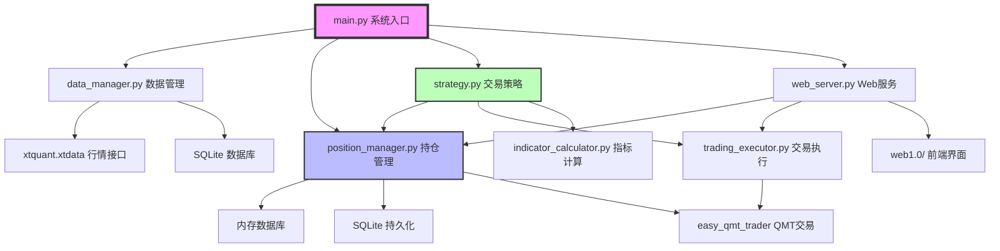
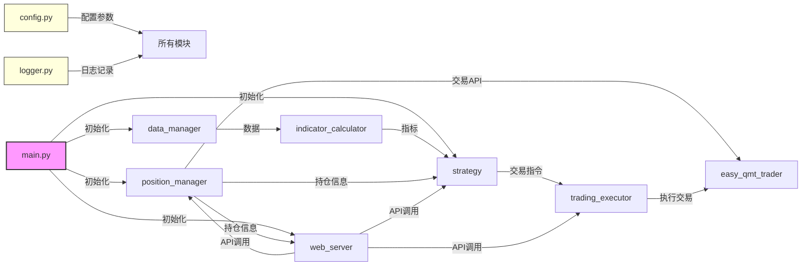
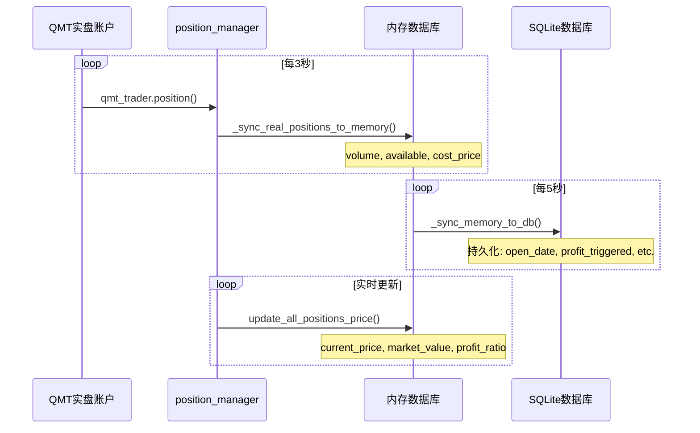
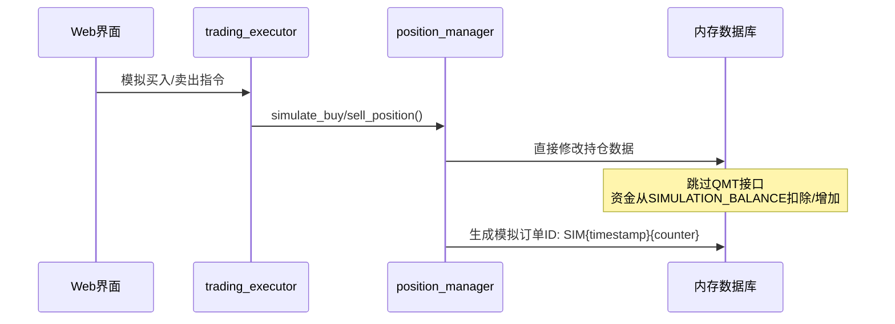
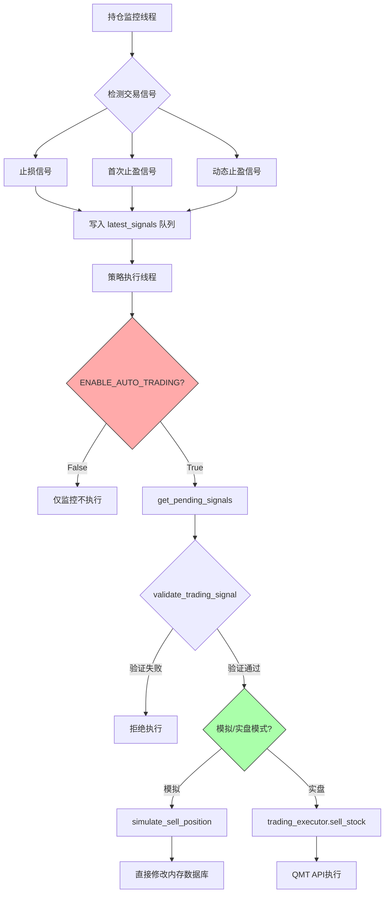

# CLAUDE.md

This file provides guidance to Claude Code (claude.ai/code) when working with code in this repository.

## 变更记录 (Changelog)

### 2024-10-11
- 全面优化文档结构，增加模块依赖关系图
- 补充环境配置和依赖说明
- 新增前端界面说明和线程架构详解
- 完善配置文件格式和测试指南
- 增加架构流程图和信号处理机制说明

---

## ⚠️ 重要提示

**在修改代码前必读**：

1. **配置集中管理**：所有可配置参数都在 [config.py](config.py) 中，严禁在其他文件硬编码配置值
2. **模拟交易优先**：测试新功能前务必设置 `ENABLE_SIMULATION_MODE = True`
3. **线程安全**：修改共享数据时必须使用 `threading.Lock()` 保护
4. **信号验证机制**：任何交易信号都要经过 `validate_trading_signal()` 验证
5. **双层存储架构**：理解内存数据库和SQLite的同步机制再修改持仓管理代码
6. **QMT路径配置**：系统支持自动检测QMT路径，修改路径逻辑需测试 [test_qmt_path_config.py](test/test_qmt_path_config.py)
7. **Git提交规范**：如用户未明确要求，不要主动执行 git 提交和分支操作

**常见错误**：
- ❌ 在 `strategy.py` 中硬编码止盈比例 → ✅ 使用 `config.INITIAL_TAKE_PROFIT_RATIO`
- ❌ 直接修改内存数据库不调用 `_increment_data_version()` → ✅ 修改后立即更新版本号
- ❌ 交易信号未验证直接执行 → ✅ 先调用 `validate_trading_signal()`

---

## 项目概述

miniQMT 是一个基于迅投QMT API的量化交易系统，实现了自动化交易策略执行、持仓管理、止盈止损和网格交易等功能。系统支持模拟交易和实盘交易两种模式。

**核心特性**：
- 双层存储架构（内存数据库 + SQLite 持久化）
- 信号检测与执行分离设计
- 多线程协同工作（数据更新、持仓监控、策略执行、Web 服务）
- 动态止盈止损策略
- 可选的网格交易功能
- Web 前端实时监控界面

## 系统架构

### 整体架构图



### 模块化设计原则

系统采用严格的模块化设计，每个py文件对应一个独立功能模块：

```
miniQMT/
├── config.py                   # 集中管理所有可配置参数
├── logger.py                   # 统一日志管理(自动清理)
├── main.py                     # 系统启动入口和线程管理
├── data_manager.py             # 历史数据获取与存储(xtdata接口)
├── indicator_calculator.py     # 技术指标计算(MACD、均线等)
├── position_manager.py         # 持仓管理核心(内存+SQLite双层架构)
├── trading_executor.py         # 交易执行器(xttrader接口)
├── strategy.py                 # 交易策略逻辑
├── web_server.py               # RESTful API服务(Flask)
├── easy_qmt_trader.py          # QMT交易API封装
├── utils.py / Methods.py       # 工具函数集合
├── MyTT.py                     # 技术指标计算工具
├── account_config.json         # 账户配置文件(敏感信息)
├── stock_pool.json             # 股票池配置
├── data/                       # 数据存储目录
│   ├── trading.db              # SQLite数据库
│   └── stock2buy.json          # 备选股票池
├── logs/                       # 日志文件目录
├── test/                       # 测试文件目录
│   ├── unit_test.py            # 单元测试
│   ├── StopLossTakeProfitTest.py  # 止盈止损测试
│   ├── GridTradingTest.py      # 网格交易测试
│   ├── test_qmt_position_interface.py  # QMT持仓接口测试
│   ├── test_qmt_path_config.py # QMT路径配置测试
│   └── test_qmt_fix_verification.py  # QMT修复验证测试
├── web1.0/                     # Web前端界面
│   ├── index.html              # 主页面
│   ├── script.js               # 前端逻辑
│   └── readme.md               # 前端说明
├── xtquant/                    # 迅投QMT SDK
└── CLAUDE.md                   # 本文档
```

### 模块依赖关系



### 线程架构

系统采用多线程并发架构，各线程职责如下：

| 线程名称 | 启动位置 | 主要职责 | 运行频率 |
|---------|---------|---------|---------|
| **数据更新线程** | `data_manager.start_data_update_thread()` | 更新股票池中所有股票的最新行情数据 | 每60秒 |
| **持仓监控线程** | `position_manager.start_position_monitor_thread()` | 1. 同步实盘持仓到内存<br>2. 更新当前价格<br>3. 检测止盈止损信号 | 每3秒 |
| **策略执行线程** | `strategy.start_strategy_thread()` | 1. 获取待处理信号<br>2. 执行交易决策<br>3. 网格交易检查 | 每5秒 |
| **定时同步线程** | `position_manager.start_sync_thread()` | 将内存数据库的关键字段同步到SQLite | 每5秒 |
| **日志清理线程** | `logger.schedule_log_cleanup()` | 清理过期日志文件 | 每天凌晨 |
| **Web服务线程** | `web_server.start_web_server()` | 提供RESTful API和前端页面服务 | 持续运行 |

**线程安全机制**：
- 使用 `threading.Lock()` 保护共享数据结构
- SQLite 连接使用 `check_same_thread=False`
- 内存数据库操作使用版本号机制避免竞态

### 数据流架构

**实盘模式数据流**:


**模拟模式数据流**:


### 信号检测与执行流程

系统采用**信号检测与执行分离**的设计模式：



**关键设计要点**：
1. 监控线程**始终运行**，持续检测信号（即使 ENABLE_AUTO_TRADING=False）
2. `ENABLE_AUTO_TRADING` 开关只控制**是否执行**检测到的信号
3. 每个信号都要经过 `validate_trading_signal()` 验证，防止重复执行
4. 信号验证包括：持仓数据一致性、信号是否过期、是否已处理

### 关键设计模式

1. **单例模式**: 所有核心模块通过 `get_*()` 函数返回单例实例
   ```python
   # 示例
   def get_position_manager():
       global _position_manager_instance
       if _position_manager_instance is None:
           _position_manager_instance = PositionManager()
       return _position_manager_instance
   ```

2. **双层存储架构**:
   - 内存数据库(`sqlite3.connect(":memory:")`)存储高频更新数据
   - SQLite文件数据库持久化关键状态(避免重启丢失)

3. **信号检测与执行分离**:
   - 监控线程负责信号检测(始终运行)
   - `ENABLE_AUTO_TRADING`开关控制是否执行交易

## 环境配置

### Python 版本要求
- Python 3.8 或以上（推荐 3.9）

### 依赖包安装

```bash
pip install pandas numpy talib flask flask-cors xtquant mootdx sqlite3
```

**关键依赖说明**：
- `pandas`, `numpy`: 数据处理和计算
- `flask`, `flask-cors`: Web服务框架
- `xtquant`: 迅投QMT交易和行情接口（需要安装QMT客户端）
- `mootdx`: 备用行情数据源
- `talib` (可选): 高级技术指标计算

### 配置文件

#### 1. account_config.json（必需）
```json
{
  "account_id": "您的交易账号",
  "account_type": "STOCK"
}
```

#### 2. stock_pool.json（可选）
```json
[
  "000001.SZ",
  "600036.SH",
  "000333.SZ"
]
```
如果不存在，系统将使用 `config.py` 中的 `DEFAULT_STOCK_POOL`。

#### 3. config.py 关键配置
```python
# QMT路径配置
QMT_PATH = r'C:/光大证券金阳光QMT实盘/userdata_mini'

# 功能开关
ENABLE_SIMULATION_MODE = True    # True=模拟交易, False=实盘交易
ENABLE_AUTO_TRADING = False      # 自动交易执行开关
ENABLE_DYNAMIC_STOP_PROFIT = True  # 止盈止损功能
ENABLE_GRID_TRADING = False      # 网格交易功能

# 调试开关
DEBUG = False
DEBUG_SIMU_STOCK_DATA = False  # 绕过交易时间限制
```

## 快速开始

### 常用命令速查

```bash
# 启动系统
python main.py

# 运行测试
python -m pytest test/unit_test.py                # 单元测试
python test/StopLossTakeProfitTest.py            # 止盈止损测试
python test/GridTradingTest.py                   # 网格交易测试
python test/easy_qmt_trader_test.py              # QMT接口测试
python test/test_qmt_position_interface.py       # 持仓接口测试
python test/test_qmt_path_config.py              # 路径配置测试

# 清理日志
python -c "from logger import clean_old_logs; clean_old_logs()"

# 检查数据库
sqlite3 data/trading.db ".tables"                # 查看所有表
sqlite3 data/trading.db "SELECT * FROM positions;"  # 查看持仓
```

### Windows 环境特别注意
- 使用 Anaconda Python 3.10 虚拟环境（默认）
- 日志文件使用 UTF-8 编码（避免中文乱码）
- 路径使用正斜杠 `/` 或双反斜杠 `\\`

## 运行系统

### 启动命令
```bash
python main.py
```

### 前端访问
打开浏览器访问：
```
http://localhost:5000
```

**前端功能**：
- 账户信息实时显示（可用资金、总资产、持仓市值）
- 持仓列表实时更新（股票代码、数量、成本价、当前价、盈亏比例）
- 全局开关控制（监控开关、自动交易开关、模拟/实盘切换）
- 手动买入/卖出操作
- 系统状态监控（QMT连接状态、各线程运行状态）

### 重要开关配置 (config.py)

```python
ENABLE_SIMULATION_MODE = True   # 模拟/实盘切换
ENABLE_AUTO_TRADING = False     # 自动交易执行开关
ENABLE_DYNAMIC_STOP_PROFIT = True   # 止盈止损功能
ENABLE_GRID_TRADING = False     # 网格交易功能
DEBUG = False                   # 调试模式
```

**开关说明**：
- `ENABLE_SIMULATION_MODE`:
  - `True`: 模拟交易，不调用真实交易API，使用虚拟资金
  - `False`: 实盘交易，通过QMT API执行真实订单

- `ENABLE_AUTO_TRADING`:
  - `True`: 检测到信号后自动执行交易
  - `False`: 仅监控信号，不执行交易（适合观察策略）

- `ENABLE_MONITORING` (前端控制):
  - 控制前端界面的监控状态显示
  - 不影响后台线程运行

## 交易策略核心逻辑

### 止盈止损策略执行优先级

1. **止损检查**(最高优先级): 成本价下跌7%触发全仓止损
2. **首次止盈**: 浮盈6%时卖出60%仓位 → 标记`profit_triggered=True`
3. **动态止盈**: 已触发首次止盈后,根据最高价设置动态止盈位
4. **补仓策略**: 价格跌至93%/86%等格点时补仓(最大持仓限制70000元)

### 止盈止损配置详解

```python
# config.py

# 统一止损比例
STOP_LOSS_RATIO = -0.07  # 成本价下跌7%触发止损

# 首次止盈配置
INITIAL_TAKE_PROFIT_RATIO = 0.06  # 盈利6%触发首次止盈
INITIAL_TAKE_PROFIT_RATIO_PERCENTAGE = 0.6  # 卖出60%仓位

# 动态止盈配置（最高盈利比例, 止盈位系数）
DYNAMIC_TAKE_PROFIT = [
    (0.05, 0.96),  # 最高浮盈5%时，止盈位=最高价*96%
    (0.10, 0.93),  # 最高浮盈10%时，止盈位=最高价*93%
    (0.15, 0.90),  # 最高浮盈15%时，止盈位=最高价*90%
    (0.20, 0.87),  # 最高浮盈20%时，止盈位=最高价*87%
    (0.30, 0.85),  # 最高浮盈30%时，止盈位=最高价*85%
]
```

### 止盈止损信号验证机制

```python
# position_manager.py 中的核心验证逻辑
validate_trading_signal(stock_code, signal_type, signal_info):
    - 检查持仓数据一致性
    - 验证信号是否仍然有效
    - 防止重复执行同一信号
    - 检查持仓数量是否充足
```

**验证失败场景**：
- 持仓已清空但信号仍在队列
- 价格已回调，信号条件不再满足
- 同一信号在冷却期内（防抖动）
- 持仓可用数量不足

### 模拟交易 vs 实盘交易

| 特性 | 模拟交易 | 实盘交易 |
|------|---------|---------|
| 执行方式 | `simulate_buy/sell_position()` 直接修改内存 | 通过 `qmt_trader.buy/sell()` 调用QMT API |
| 资金来源 | `config.SIMULATION_BALANCE` | 实际账户资金 |
| 订单ID | `SIM{timestamp}{counter}` | QMT API返回的真实订单号 |
| 数据持久化 | 仅内存,不写入SQLite | 内存+SQLite双写 |
| 交易时间限制 | 无限制(DEBUG_SIMU_STOCK_DATA=True) | 严格遵守交易时间 |
| 手续费 | 模拟手续费(买0.0003/卖0.0013) | 实际手续费 |

## 开发和测试

### 运行测试
```bash
# 单元测试
python -m pytest test/unit_test.py

# 止盈止损策略测试
python test/StopLossTakeProfitTest.py

# 网格交易测试
python test/GridTradingTest.py

# QMT交易接口测试
python test/easy_qmt_trader_test.py

# QMT持仓接口测试（验证持仓数据同步）
python test/test_qmt_position_interface.py

# QMT路径配置测试（验证路径自动检测）
python test/test_qmt_path_config.py

# QMT修复验证测试（验证接口修复）
python test/test_qmt_fix_verification.py
```

### 调试技巧

**启用详细日志**:
```python
# config.py
DEBUG = True
LOG_LEVEL = "DEBUG"
```

**测试模拟交易**:
```python
# config.py
ENABLE_SIMULATION_MODE = True
DEBUG_SIMU_STOCK_DATA = True  # 绕过交易时间限制
```

**监控关键数据流**:
```python
# 查看内存持仓数据
position_manager.get_all_positions()

# 查看待执行信号
position_manager.get_pending_signals()

# 检查账户信息
position_manager.get_account_info()

# 查看信号队列
position_manager.latest_signals
```

**调试止盈止损逻辑**:
```python
# 在 strategy.py 中添加断点
def execute_trading_signal_direct(self, stock_code, signal_type, signal_info):
    # 在此处设置断点，观察信号内容
    logger.debug(f"执行信号: {signal_type}, 信息: {signal_info}")
```

## API接口说明

### Web API端点 (web_server.py)

**系统状态**:
- `GET /api/status` - 获取系统运行状态
  - 返回：账户信息、监控状态、全局开关状态
- `GET /api/connection/status` - 检查QMT连接状态

**持仓管理**:
- `GET /api/positions` - 获取所有持仓
  - 返回：持仓列表、数据版本号
- `GET /api/positions/<stock_code>` - 获取单只股票持仓
- `GET /api/positions/stream` - SSE实时推送持仓数据

**交易操作**:
- `POST /api/actions/execute_buy` - 执行买入操作
  - 参数：`stock_code`, `amount`, `strategy`(可选)
- `POST /api/actions/execute_sell` - 执行卖出操作
  - 参数：`stock_code`, `volume`, `strategy`(可选)
- `POST /api/actions/execute_trading_signal` - 执行指定交易信号
  - 参数：`stock_code`, `signal_type`, `signal_info`

**配置管理**:
- `GET /api/config` - 获取系统配置
- `POST /api/config/update` - 更新配置参数
  - 支持动态更新：止盈止损比例、仓位限制等

**信号查询**:
- `GET /api/signals/pending` - 获取待处理信号列表
- `GET /api/signals/latest/<stock_code>` - 获取指定股票的最新信号

**数据查询**:
- `GET /api/data/history/<stock_code>` - 获取历史K线数据
- `GET /api/data/realtime/<stock_code>` - 获取实时行情

## QMT API集成要点

### xtdata(行情接口)
```python
# data_manager.py
import xtquant.xtdata as xt

# 连接行情服务
xt.connect()

# 获取历史数据
xt.get_market_data(
    field_list=['open', 'high', 'low', 'close', 'volume'],
    stock_list=['000001.SZ'],
    period='1d',
    start_time='20230101',
    end_time='20231231'
)

# 获取实时Tick数据
xt.get_full_tick(['000001.SZ'])
```

### xttrader(交易接口)
```python
# easy_qmt_trader.py
from xtquant.xttrader import XtQuantTrader
from xtquant.xttype import StockAccount

# 创建交易对象
xt_trader = XtQuantTrader(path, session_id)

# 启动交易线程
xt_trader.start()

# 连接账户
acc = StockAccount(account_id, account_type)
xt_trader.connect()

# 下单
xt_trader.order_stock(
    acc,
    stock_code,
    order_type,  # 23=限价买入, 24=限价卖出
    order_volume,
    order_price
)

# 查询持仓
xt_trader.query_stock_positions(acc)

# 查询资产
xt_trader.query_stock_asset(acc)
```

### API异常处理
- 始终检查`xt.connect()`连接状态
- 交易接口调用需要捕获超时和网络异常
- 使用`check_same_thread=False`处理多线程SQLite操作
- 实盘交易前必须验证 QMT 客户端运行状态

```python
# 连接检查示例
try:
    if not xt.connect():
        logger.error("xtquant行情服务连接失败")
        return False

    # 验证连接
    test_data = xt.get_full_tick(['000001.SZ'])
    if test_data:
        logger.info("xtquant连接验证成功")
except Exception as e:
    logger.error(f"连接异常: {str(e)}")
```

## 数据库表结构

### positions (持仓表 - 内存+SQLite)
```sql
CREATE TABLE positions (
    stock_code TEXT PRIMARY KEY,       -- 股票代码
    stock_name TEXT,                   -- 股票名称
    volume REAL,                       -- 持仓数量(来自QMT)
    available REAL,                    -- 可用数量(来自QMT)
    cost_price REAL,                   -- 成本价(来自QMT)
    base_cost_price REAL,              -- 基础成本价
    current_price REAL,                -- 当前价(来自行情接口)
    market_value REAL,                 -- 市值(计算得出)
    profit_ratio REAL,                 -- 盈亏比例(计算得出)
    last_update TIMESTAMP,             -- 最后更新时间
    open_date TIMESTAMP,               -- 开仓日期(持久化)
    profit_triggered BOOLEAN,          -- 是否触发首次止盈(持久化)
    highest_price REAL,                -- 历史最高价(持久化)
    stop_loss_price REAL,              -- 止损价(持久化)
    profit_breakout_triggered BOOLEAN, -- 是否触发突破止盈
    breakout_highest_price REAL        -- 突破后最高价
)
```

**数据来源说明**：

| 字段 | 数据来源 | 更新时机 |
|------|---------|---------|
| `stock_code`, `volume`, `available`, `cost_price` | QMT实盘 `qmt_trader.position()` | 每3秒同步一次 |
| `current_price` | `data_manager.get_latest_data()` | 实时更新 |
| `market_value`, `profit_ratio` | 计算 | 价格更新时重新计算 |
| `open_date`, `profit_triggered`, `highest_price`, `stop_loss_price` | 持久化字段 | 策略触发时更新并立即同步到SQLite |

### trade_records (交易记录表)
```sql
CREATE TABLE trade_records (
    id INTEGER PRIMARY KEY AUTOINCREMENT,
    stock_code TEXT,                   -- 股票代码
    stock_name TEXT,                   -- 股票名称
    trade_time TIMESTAMP,              -- 交易时间
    trade_type TEXT,                   -- BUY, SELL
    price REAL,                        -- 交易价格
    volume INTEGER,                    -- 交易数量
    amount REAL,                       -- 交易金额
    trade_id TEXT,                     -- 订单ID
    commission REAL,                   -- 手续费
    strategy TEXT                      -- 策略标识(simu/auto_partial/stop_loss/grid等)
)
```

### stock_daily_data (历史K线数据表)
```sql
CREATE TABLE stock_daily_data (
    stock_code TEXT,
    stock_name TEXT,
    date TEXT,
    open REAL,
    high REAL,
    low REAL,
    close REAL,
    volume REAL,
    amount REAL,
    PRIMARY KEY (stock_code, date)
)
```

### stock_indicators (指标数据表)
```sql
CREATE TABLE stock_indicators (
    stock_code TEXT,
    date TEXT,
    ma10 REAL,
    ma20 REAL,
    ma30 REAL,
    ma60 REAL,
    macd REAL,
    macd_signal REAL,
    macd_hist REAL,
    PRIMARY KEY (stock_code, date)
)
```

## 常见问题

### 1. 止盈止损信号重复执行
**原因**: 信号验证失败或信号未被正确标记为已处理

**解决方案**:
- 检查`validate_trading_signal()`和`mark_signal_processed()`调用链
- 确认信号时间戳机制正常工作
- 查看日志中的信号验证详情

```python
# 添加日志以追踪信号处理
logger.debug(f"信号队列: {position_manager.latest_signals}")
logger.debug(f"信号时间戳: {position_manager.signal_timestamps}")
```

### 2. 模拟交易持仓不更新
**原因**: 模拟交易只修改内存,未触发数据版本号更新

**解决方案**:
- 确保调用`_increment_data_version()`
- 检查前端是否正确订阅 SSE 推送
- 验证 `config.ENABLE_SIMULATION_MODE = True`

```python
# position_manager.py
def simulate_buy_position(self, ...):
    # ... 执行模拟买入逻辑 ...
    self._increment_data_version()  # 必须调用
```

### 3. QMT连接断开
**原因**: QMT客户端未运行或网络问题

**解决方案**:
```python
# 检查连接状态
position_manager.qmt_trader.xt_trader.is_connected()

# 重新连接
position_manager.qmt_trader.connect()

# 检查QMT客户端路径配置
# config.py
QMT_PATH = r'C:/光大证券金阳光QMT实盘/userdata_mini'  # 确保路径正确
```

### 4. 持仓监控线程未运行
**原因**: 线程异常退出或未正确启动

**排查步骤**:
```python
# 1. 检查配置开关
config.ENABLE_POSITION_MONITOR  # 应为 True

# 2. 检查线程状态
import threading
print(threading.enumerate())  # 查看所有活动线程

# 3. 查看日志
# 搜索 "启动持仓监控线程" 或 "持仓监控线程异常"
```

### 5. 前端无法连接后端
**原因**: 端口被占用或防火墙阻止

**解决方案**:
```bash
# 检查端口占用
netstat -ano | findstr 5000

# 修改端口配置
# config.py
WEB_SERVER_PORT = 5001  # 改为其他端口

# 允许防火墙通过
# Windows: 控制面板 -> 防火墙 -> 允许应用
```

### 6. 策略信号检测异常
**原因**: 价格数据获取失败或计算错误

**排查步骤**:
```python
# 1. 检查数据源连接
data_manager.xt.connect()  # 确保 xtquant 已连接

# 2. 手动获取价格
latest_quote = data_manager.get_latest_data('000001.SZ')
print(latest_quote)

# 3. 检查持仓数据完整性
position = position_manager.get_position('000001.SZ')
print(f"成本价: {position['cost_price']}, 当前价: {position['current_price']}")
```

## 代码规范

1. **所有可配置参数集中在config.py** - 不要硬编码魔法数字
   ```python
   # 错误示例
   if profit_ratio > 0.06:  # 硬编码
       ...

   # 正确示例
   if profit_ratio > config.INITIAL_TAKE_PROFIT_RATIO:
       ...
   ```

2. **日志级别使用**:
   - `logger.debug()` - 详细调试信息（变量值、执行路径）
   - `logger.info()` - 关键流程节点（系统启动、交易执行）
   - `logger.warning()` - 异常但可恢复的情况（数据缺失、连接超时）
   - `logger.error()` - 严重错误（模块初始化失败、数据库错误）

3. **异常处理**: 所有外部API调用必须有try-except包裹
   ```python
   try:
       result = qmt_trader.order_stock(...)
       logger.info(f"下单成功: {result}")
   except Exception as e:
       logger.error(f"下单失败: {str(e)}")
       return None
   ```

4. **线程安全**: 使用`threading.Lock()`保护共享数据结构
   ```python
   with self.signal_lock:
       self.latest_signals[stock_code] = signal_info
   ```

5. **数据库操作**: 使用参数化查询防止SQL注入
   ```python
   # 正确示例
   cursor.execute("SELECT * FROM positions WHERE stock_code=?", (stock_code,))

   # 错误示例
   cursor.execute(f"SELECT * FROM positions WHERE stock_code='{stock_code}'")
   ```

6. **函数文档**: 所有公共函数必须包含 docstring
   ```python
   def calculate_stop_loss_price(self, position):
       """
       计算止损价格

       参数:
           position (dict): 持仓信息字典

       返回:
           float: 计算出的止损价格
       """
       ...
   ```

## 扩展开发建议

1. **新增交易策略**: 在`strategy.py`中添加新的`execute_*_strategy()`方法
   ```python
   def execute_custom_strategy(self, stock_code):
       """自定义策略实现"""
       # 1. 获取必要数据
       position = self.position_manager.get_position(stock_code)
       latest_quote = self.data_manager.get_latest_data(stock_code)

       # 2. 策略逻辑判断
       if self._check_custom_condition(position, latest_quote):
           # 3. 执行交易
           self.trading_executor.buy_stock(...)
   ```

2. **新增技术指标**: 在`indicator_calculator.py`中实现计算函数
   ```python
   def calculate_rsi(self, df, period=14):
       """计算RSI指标"""
       delta = df['close'].diff()
       gain = (delta.where(delta > 0, 0)).rolling(window=period).mean()
       loss = (-delta.where(delta < 0, 0)).rolling(window=period).mean()
       rs = gain / loss
       return 100 - (100 / (1 + rs))
   ```

3. **新增Web接口**: 在`web_server.py`中添加路由装饰器
   ```python
   @app.route('/api/custom/action', methods=['POST'])
   def custom_action():
       """自定义API端点"""
       try:
           data = request.json
           # 处理逻辑
           return jsonify({'status': 'success', 'data': result})
       except Exception as e:
           return jsonify({'status': 'error', 'message': str(e)}), 500
   ```

4. **修改止盈止损逻辑**: 修改`config.py`中的`DYNAMIC_TAKE_PROFIT`配置数组
   ```python
   DYNAMIC_TAKE_PROFIT = [
       (0.08, 0.95),  # 新增：8%盈利时止盈位为最高价的95%
       (0.12, 0.92),  # 调整原有配置
       ...
   ]
   ```

5. **增加回测功能**: 创建新模块`backtest.py`
   ```python
   class Backtester:
       def __init__(self, strategy, start_date, end_date):
           self.strategy = strategy
           self.start_date = start_date
           self.end_date = end_date

       def run_backtest(self):
           # 回测逻辑实现
           pass
   ```

## 性能优化建议

1. **数据库查询优化**:
   - 为高频查询字段添加索引
   ```sql
   CREATE INDEX idx_positions_code ON positions(stock_code);
   CREATE INDEX idx_trade_records_time ON trade_records(trade_time);
   ```

2. **缓存机制**:
   - 对不常变化的数据使用缓存
   ```python
   # position_manager.py
   self.positions_cache = None
   self.cache_expire_time = 3  # 3秒缓存
   ```

3. **批量操作**:
   - 批量更新数据库而非逐条插入
   ```python
   cursor.executemany(
       "INSERT INTO positions VALUES (?, ?, ...)",
       positions_list
   )
   ```

4. **线程池**:
   - 对耗时操作使用线程池
   ```python
   from concurrent.futures import ThreadPoolExecutor

   with ThreadPoolExecutor(max_workers=5) as executor:
       futures = [executor.submit(process_stock, code) for code in stock_pool]
   ```

## 安全注意事项

1. **敏感信息保护**:
   - `account_config.json` 不要提交到版本控制
   - 添加到 `.gitignore`
   ```
   account_config.json
   *.log
   data/trading.db
   ```

2. **实盘交易风控**:
   - 设置最大单日亏损限制
   - 实现紧急停止机制
   ```python
   # config.py
   MAX_DAILY_LOSS_RATIO = 0.05  # 单日最大亏损5%
   EMERGENCY_STOP_LOSS_RATIO = 0.10  # 紧急止损阈值10%
   ```

3. **API调用限制**:
   - 控制调用频率避免被限流
   ```python
   import time

   def rate_limited_api_call(func, *args, **kwargs):
       time.sleep(0.5)  # 限制调用频率
       return func(*args, **kwargs)
   ```

## 参考资源

- **QMT API文档**: https://dict.thinktrader.net
- **项目详细文档**: [MiniQMT.md](MiniQMT.md)
- **xtquant 官方文档**: 参考QMT客户端帮助文档
- **技术指标库**: MyTT.py (自定义技术指标工具)

## 最近更新（Recent Updates）

### QMT路径自动检测功能
系统现在支持自动检测QMT安装路径，无需手动配置：
- 自动扫描常见安装位置（C盘、D盘、E盘）
- 支持多个券商版本（光大证券、国金证券等）
- 自动验证路径有效性
- 详见：[test_qmt_path_config.py](test/test_qmt_path_config.py)

### QMT持仓接口修复
修复了持仓数据同步问题：
- 解决 `base_cost_price` 数据不一致问题
- 优化实盘持仓到内存数据库的同步逻辑
- 增强数据验证机制
- 详见：[test_qmt_fix_verification.py](test/test_qmt_fix_verification.py)、[docs/QMT持仓接口修复测试报告.md](docs/QMT持仓接口修复测试报告.md)

### 文档完善
- 新增路径配置指南：[docs/QMT路径配置指南.md](docs/QMT路径配置指南.md)
- 新增路径灵活配置说明：[docs/QMT路径灵活配置功能说明.md](docs/QMT路径灵活配置功能说明.md)

## 开发路线图

**短期目标（已实现）**:
- [x] 双层存储架构
- [x] 模拟交易功能
- [x] 止盈止损策略
- [x] Web界面监控
- [x] 信号检测与执行分离
- [x] QMT路径自动检测
- [x] 持仓接口修复和验证

**中期目标**:
- [ ] 完善网格交易策略
- [ ] 增加更多技术指标
- [ ] 实现回测功能
- [ ] 优化前端界面（React重构）
- [ ] 增加风控模块

**长期目标**:
- [ ] 支持多账户管理
- [ ] 策略市场（共享自定义策略）
- [ ] 机器学习模型集成
- [ ] 移动端应用
- [ ] 云端部署支持

---

## 变更日志（Change Log）

查看 `docs/` 目录下的相关文档了解具体功能更新详情：
- QMT持仓接口修复：[docs/QMT持仓接口修复测试报告.md](docs/QMT持仓接口修复测试报告.md)
- QMT路径配置：[docs/QMT路径配置指南.md](docs/QMT路径配置指南.md)、[docs/QMT路径灵活配置功能说明.md](docs/QMT路径灵活配置功能说明.md)
