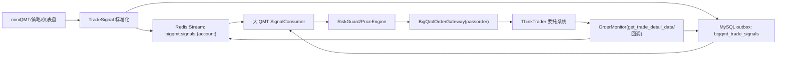
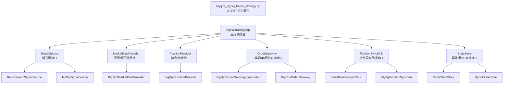
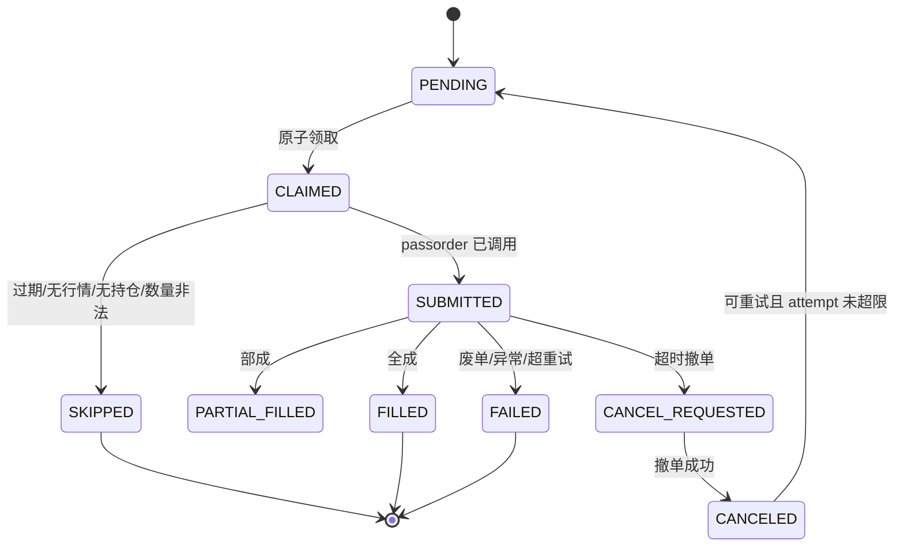

# 大 QMT 信号下单包实施方案

> **For agentic workers:** REQUIRED SUB-SKILL: Use superpowers:subagent-driven-development (recommended) or superpowers:executing-plans to implement this plan task-by-task. Steps use checkbox (`- [ ]`) syntax for tracking.

**Goal:** 在大 QMT 策略环境内新增一套独立的买入/卖出信号消费与下单包，用 Redis 或 MySQL 同步外部交易信号，未来用于替换 miniQMT 的真实下单，但本阶段不改、不删除现有 miniQMT 下单逻辑。

**Architecture:** miniQMT/仪表盘/策略端只产出标准化交易信号，大 QMT 策略作为唯一真实委托执行端。新系统必须写成可替代包：数据获取、信号读取、下单、撤单、委托查询、持仓同步、状态写回全部通过接口和 adapter 装配；大 QMT 运行文件只负责初始化、响应调度和回调，不直接写死业务细节。

**Tech Stack:** Python、ThinkTrader 大 QMT 内置交易函数、Redis、MySQL、可选 SQLite 本地缓存、现有 `jq2qmt-main/src/api/qmt_jq_trade` 的 `passorder/cancel/get_trade_detail_data` 用法。

---

## 1. 现状判断

### 1.1 大 QMT 示例项目可复用部分

参考文件：`D:/gjzqqmt/jq2qmt-main/src/api/qmt_jq_trade`

可复用设计：
- `adjust(ContextInfo)` 定时轮询执行。
- `init(ContextInfo)` 初始化账户与定时任务。
- `passorder(...)` 在大 QMT 模型交易环境内真实委托。
- `get_trade_detail_data(account, 'STOCK', 'ORDER'/'POSITION', strategy_name)` 查询委托和持仓。
- `cancel(order_sys_id, account, 'STOCK', ContextInfo)` 撤销未完成委托。
- `_place_order()` 中基于 `ContextInfo.get_full_tick([code])` 和 `ContextInfo.get_instrumentdetail(code)` 生成限价。

需要改造的点：
- 当前项目同步的是“目标持仓”，不是“逐笔买卖信号”。
- 当前 `_place_order()` 没有信号幂等、信号状态写回、重启恢复。
- 当前 `sync_positions()` 是持仓差异同步，会主动根据目标仓位推导买卖；本方案要消费外部已经决策好的买卖信号，避免大 QMT 再做策略判断。

### 1.2 miniQMT 当前指令形态

现有 miniQMT 的远程指令主要有三类：
- `buy_commands`: `{"stock_code": "000001.SZ", "amount": 100, "force": true/false}`
- `sell_commands`: `{"stock_code": "000001.SZ", "percentage": 50}`
- `clear_positions`: `{"percentage": 100}`，表示一键清仓或按比例清仓。

现有下单入口是 `core.trader.execute_order()`，内部已包含：
- 价格、数量、测试模式日志。
- 白名单/锁定卖出拦截。
- 自动策略每日交易次数熔断。
- 人工卖出/一键清仓绕过自动熔断。
- 卖出可用数量前置截断。

大 QMT 新包不能直接复用 `execute_order()`，因为它运行环境不同；但必须把这些安全语义迁移成信号字段和消费端前置校验。

---

## 2. 目标架构



### 2.1 推荐优先级

1. Redis Stream 作为主通道。
   - 支持 consumer group、ack、pending 重试。
   - 断线后不会像 Pub/Sub 一样丢信号。
   - 比普通 List 更容易做领取、确认和重放。
2. MySQL outbox 作为备用和审计。
   - 每条信号全量落库。
   - Redis 不可用时，大 QMT 可直接轮询 MySQL `pending` 信号。
   - 线上问题可按 `signal_id` 复盘。
3. 不建议第一版使用 Redis Pub/Sub 直接下单。
   - 断线会丢消息。
   - 大 QMT 策略环境里长阻塞订阅线程容易影响模型运行稳定性。

### 2.2 可替代包边界

新包不能写成 `qmt_jq_trade` 那种单文件脚本。它必须有清晰的应用层和 adapter 层：



替换要求：

| 能力 | 接口 | 默认 adapter | 后续可替换 adapter | 不能写死的位置 |
|---|---|---|---|---|
| 信号读取 | `SignalSource` | `RedisStreamSignalSource` | `MySqlSignalSource`、HTTP source、文件回放 source | `runner.py` |
| 信号状态写回 | `StateStore` | `RedisStateStore + MySqlStateStore` | SQLite、本地文件、Dashboard API | `OrderGateway`、`runner.py` |
| 行情获取 | `MarketDataProvider` | `BigQmtMarketDataProvider` | miniQMT 行情、Redis 行情、回测行情 | `price_engine.py` |
| 标的信息 | `InstrumentProvider` | `BigQmtInstrumentProvider` | Redis ETF 缓存、MySQL 证券主表 | `code_utils.py` |
| 持仓/资金查询 | `PositionProvider` | `BigQmtPositionProvider` | miniQMT 查询、MySQL 快照、测试 fake | `risk_guard.py` |
| 下单/撤单 | `OrderGateway` | `BigQmtOrderGateway` | `DryRunOrderGateway`、miniQMT 兼容 gateway | `SignalTradingApp` |
| 持仓同步 | `PositionSyncSink` | `MySqlPositionSyncSink` | Redis Hash、Dashboard API、日志文件 | `runner.py` |
| 调度/回调 | `RuntimeAdapter` | `BigQmtRuntimeAdapter` | 命令行 runner、测试 runner | 包内部服务 |

### 2.3 核心接口契约

第一版用 `typing.Protocol` 定义接口，运行时用普通类实现，避免大 QMT 环境对复杂依赖敏感。

```python
class SignalSource(Protocol):
    def fetch(self, account_id: str, limit: int) -> list[TradeSignal]:
        """读取待处理信号，不在这里下单。"""

    def ack(self, signal: TradeSignal) -> None:
        """信号进入终态后确认。"""
```

```python
class MarketDataProvider(Protocol):
    def get_ticks(self, codes: list[str]) -> dict[str, dict]:
        """返回 lastPrice、bidPrice、askPrice 等实时行情。"""

    def get_instrument(self, code: str) -> dict:
        """返回涨跌停价、停牌状态、价格精度等标的信息。"""
```

```python
class PositionProvider(Protocol):
    def get_positions(self, account_id: str) -> dict[str, PositionSnapshot]:
        """返回当前持仓和可用数量。"""

    def get_asset(self, account_id: str) -> AssetSnapshot:
        """返回现金、总资产等资金信息。"""
```

```python
class OrderGateway(Protocol):
    def submit(self, request: OrderRequest) -> OrderSubmitResult:
        """提交委托。真实实现调用 passorder，dry-run 实现只记录参数。"""

    def cancel(self, order_ref: OrderRef) -> CancelResult:
        """撤销委托。"""

    def query_orders(self, account_id: str, strategy_name: str) -> list[OrderSnapshot]:
        """查询委托状态。"""

    def query_trades(self, account_id: str, strategy_name: str) -> list[TradeSnapshot]:
        """查询成交回报。"""
```

```python
class PositionSyncSink(Protocol):
    def publish(self, snapshot: AccountSnapshot) -> None:
        """同步大 QMT 实际持仓和资产，用于 Dashboard/miniQMT 观察。"""
```

```python
class StateStore(Protocol):
    def claim(self, signal: TradeSignal, consumer_id: str) -> bool:
        """原子领取信号。返回 False 时绝不能下单。"""

    def mark_submitted(self, signal_id: str, result: OrderSubmitResult) -> None:
        """记录 passorder 已提交。"""

    def mark_finished(self, signal_id: str, status: str, message: str = "") -> None:
        """记录 FILLED、FAILED、SKIPPED 等终态。"""
```

### 2.4 应用层响应要求

`SignalTradingApp` 是唯一编排入口。大 QMT 运行文件、命令行 runner、测试环境都只调用它。

```python
class SignalTradingApp:
    def on_init(self, runtime: RuntimeAdapter) -> None:
        """初始化账户、adapter、状态缓存。"""

    def tick(self, now: datetime) -> None:
        """一次调度周期：拉信号、claim、风控、下单、同步持仓、刷新订单。"""

    def on_order_event(self, event: OrderEvent) -> None:
        """响应大 QMT 委托回调，更新状态。"""

    def on_trade_event(self, event: TradeEvent) -> None:
        """响应成交回调，更新状态并触发持仓同步。"""

    def sync_positions(self, reason: str) -> None:
        """主动同步实际持仓和资产。"""
```

运行文件必须响应这些动作：

| 大 QMT 入口 | 必须调用 | 说明 |
|---|---|---|
| `init(ContextInfo)` | `app.on_init(runtime)` | 初始化账户、设置 `ContextInfo.set_account(account)`、启动第一次调度。 |
| `adjust(ContextInfo)` | `app.tick(now)` | 周期性消费信号、下单、刷新订单、同步持仓。 |
| 委托回调 | `app.on_order_event(event)` | 如果大 QMT 提供委托回调，立即写回状态；没有回调时由 `tick()` 轮询兜底。 |
| 成交回调 | `app.on_trade_event(event)` | 成交后同步持仓和成交状态。 |
| 手动触发同步 | `app.sync_positions("manual")` | 可从运行文件或调试命令触发。 |

---

## 3. 标准信号协议

### 3.1 JSON 字段

```json
{
  "signal_id": "20260630-wangju-000001.SZ-buy-000001",
  "account_id": "wangju",
  "source": "dashboard",
  "source_type": "manual",
  "action": "BUY",
  "stock_code": "000001.SZ",
  "stock_name": "平安银行",
  "amount": 1000,
  "percentage": null,
  "price_type": "AUTO_LIMIT",
  "price": null,
  "strategy_name": "bigqmt_signal_trader",
  "remark": "web_buy_command",
  "force": false,
  "bypass_stop_buy": false,
  "bypass_stop_sell": false,
  "bypass_daily_limit": false,
  "created_at": "2026-06-30 09:31:00",
  "expire_at": "2026-06-30 09:36:00",
  "schema_version": 1
}
```

### 3.2 字段语义

| 字段 | 必填 | 说明 |
|---|---:|---|
| `signal_id` | 是 | 全局唯一幂等键。不能只用股票代码，否则补单和多策略会互相覆盖。 |
| `account_id` | 是 | 账户/客户端标识，用于 Redis key 和 MySQL 分账户隔离。 |
| `source` | 是 | `dashboard`、`miniqmt_strategy`、`t0`、`risk` 等。 |
| `source_type` | 是 | `manual` 或 `auto`，影响熔断和 stop 开关语义。 |
| `action` | 是 | `BUY`、`SELL`、`CLEAR`、`CANCEL`。第一版先实现 BUY/SELL/CLEAR。 |
| `stock_code` | BUY/SELL 必填 | 标准 QMT 后缀格式，如 `600000.SH`、`000001.SZ`。 |
| `amount` | BUY 必填 | 买入股数；SELL 可选，SELL 缺省时用 `percentage` 计算。 |
| `percentage` | SELL/CLEAR 常用 | 卖出当前可用持仓比例。 |
| `price_type` | 是 | 第一版支持 `AUTO_LIMIT`、`FIX_PRICE`。 |
| `price` | 条件必填 | `FIX_PRICE` 时必填；`AUTO_LIMIT` 时由大 QMT 用 tick 生成。 |
| `remark` | 是 | 写入 `userOrderId` 或策略备注的一部分，用于审计。 |
| `force` | 否 | 强制买入/卖出标记。 |
| `bypass_*` | 否 | 保留 miniQMT 当前人工卖出/一键清仓绕过逻辑。 |
| `expire_at` | 是 | 过期信号必须跳过，避免早盘积压信号午后误下。 |

### 3.3 miniQMT 指令映射

```python
def map_buy_command(account_id, cmd):
    return {
        "signal_id": make_signal_id(account_id, "BUY", cmd["stock_code"], cmd),
        "account_id": account_id,
        "source": "dashboard",
        "source_type": "manual" if cmd.get("manual", True) else "auto",
        "action": "BUY",
        "stock_code": normalize_code(cmd["stock_code"]),
        "amount": int(cmd["amount"]),
        "percentage": None,
        "price_type": "AUTO_LIMIT",
        "price": None,
        "remark": "web_buy_command",
        "force": bool(cmd.get("force", False)),
        "bypass_stop_buy": bool(cmd.get("force", False)),
        "bypass_daily_limit": False,
        "expire_at": now_plus_seconds(300),
        "schema_version": 1,
    }
```

```python
def map_sell_command(account_id, cmd):
    return {
        "signal_id": make_signal_id(account_id, "SELL", cmd["stock_code"], cmd),
        "account_id": account_id,
        "source": "dashboard",
        "source_type": "manual",
        "action": "SELL",
        "stock_code": normalize_code(cmd["stock_code"]),
        "amount": None,
        "percentage": float(cmd.get("percentage", 100)),
        "price_type": "AUTO_LIMIT",
        "price": None,
        "remark": "web_sell_command",
        "force": True,
        "bypass_stop_sell": True,
        "bypass_daily_limit": True,
        "expire_at": now_plus_seconds(300),
        "schema_version": 1,
    }
```

```python
def map_clear_command(account_id, percentage):
    return {
        "signal_id": make_signal_id(account_id, "CLEAR", "*", {"percentage": percentage}),
        "account_id": account_id,
        "source": "dashboard",
        "source_type": "manual",
        "action": "CLEAR",
        "stock_code": "*",
        "amount": None,
        "percentage": float(percentage),
        "price_type": "AUTO_LIMIT",
        "price": None,
        "remark": "一键清仓",
        "force": True,
        "bypass_stop_sell": True,
        "bypass_daily_limit": True,
        "expire_at": now_plus_seconds(180),
        "schema_version": 1,
    }
```

---

## 4. 建议新增文件结构

目标目录：`D:/gjzqqmt/jq2qmt-main/src/bigqmt_signal_trader/`

| 文件 | 职责 |
|---|---|
| `__init__.py` | 包初始化，不做任何 I/O。 |
| `config.py` | 大 QMT 端配置：账户、启用的 adapter、Redis/MySQL、轮询间隔、dry-run、交易限制。 |
| `contracts.py` | 所有可替换能力的 `Protocol` 接口：`SignalSource`、`MarketDataProvider`、`PositionProvider`、`OrderGateway`、`PositionSyncSink`、`StateStore`。 |
| `models.py` | `TradeSignal`、`SignalStatus`、`OrderSubmitResult` 数据结构和校验。 |
| `code_utils.py` | 股票/ETF 代码标准化、市场后缀、最小委托单位判断。 |
| `app.py` | `SignalTradingApp` 应用编排层，唯一负责串联信号、风控、价格、下单、同步。 |
| `risk_guard.py` | 过期、交易时段、重复、资金、持仓、可用数量、daily limit 前置校验。 |
| `price_engine.py` | 基于 `MarketDataProvider` 返回的 tick 和 instrument 数据计算委托价格，不直接依赖 `ContextInfo`。 |
| `order_monitor.py` | 轮询委托/成交状态，更新 Redis/MySQL 状态。 |
| `adapter_factory.py` | 按配置装配 Redis/MySQL/BigQMT/DryRun adapter。 |
| `runtime_bigqmt.py` | 大 QMT 运行环境适配器，封装 `ContextInfo`、`passorder`、`cancel`、`get_trade_detail_data`。 |
| `runner.py` | 大 QMT 策略入口可复用函数：`init_app(ContextInfo)`、`tick_app(ContextInfo)`、回调转发。 |
| `README.md` | 大 QMT 策略内安装、配置、运行、回滚说明。 |

子目录：

| 目录/文件 | 职责 |
|---|---|
| `adapters/signal_redis.py` | Redis Stream 信号读取、ack、pending reclaim。 |
| `adapters/signal_mysql.py` | MySQL outbox 信号读取、原子 claim。 |
| `adapters/state_redis.py` | Redis 状态 Hash 写回。 |
| `adapters/state_mysql.py` | MySQL 状态表写回。 |
| `adapters/market_bigqmt.py` | 大 QMT 行情和标的信息读取。 |
| `adapters/position_bigqmt.py` | 大 QMT 持仓和资金查询。 |
| `adapters/order_bigqmt.py` | `passorder/cancel/get_trade_detail_data` 下单通道。 |
| `adapters/order_dryrun.py` | dry-run 下单通道，联调时不发真实委托。 |
| `adapters/position_sync_redis.py` | 同步大 QMT 实际持仓到 Redis。 |
| `adapters/position_sync_mysql.py` | 同步大 QMT 实际持仓到 MySQL。 |
| `services/execution_service.py` | 单条信号执行流程：claim、校验、价格、数量、submit。 |
| `services/position_sync_service.py` | 周期性和成交后持仓同步。 |
| `services/reconcile_service.py` | 重启后根据委托/成交回报修复未终态信号。 |

大 QMT 运行文件单独放：

| 文件 | 职责 |
|---|---|
| `D:/gjzqqmt/jq2qmt-main/src/bigqmt_signal_trader_strategy.py` | ThinkTrader 策略加载文件，只做账号配置、创建 app、把 `init/adjust/回调` 转发给包。 |

目标测试目录：`D:/gjzqqmt/jq2qmt-main/tests/bigqmt_signal_trader/`

| 文件 | 职责 |
|---|---|
| `test_contracts.py` | fake adapter 能被 `SignalTradingApp` 装配和替换。 |
| `test_models.py` | 信号字段校验、过期判断。 |
| `test_code_utils.py` | 代码标准化、ETF/股票最小委托单位。 |
| `test_price_engine.py` | 用 fake ContextInfo 测买卖价格生成。 |
| `test_signal_store_mysql.py` | 用 fake connection 测 pending -> claimed 原子状态流。 |
| `test_order_gateway.py` | 注入 fake `passorder`，验证参数映射和 userOrderId。 |
| `test_app.py` | 用 fake signal/market/position/order/sync adapter 测一次完整 tick。 |
| `test_runner.py` | 验证大 QMT 运行文件只转发，不直接执行业务。 |

---

## 5. 大 QMT 下单执行细节

### 5.1 买卖方向和 `passorder`

大 QMT 消费端统一用以下映射：

| action | opType | 说明 |
|---|---:|---|
| `BUY` | `23` | 买入 |
| `SELL` | `24` | 卖出 |

第一版只用限价单：

```python
passorder(
    op_type,          # 23 买入，24 卖出
    1101,             # 组合方式，沿用现有 qmt_jq_trade
    account,          # 资金账号
    stock_code,       # 000001.SZ / 600000.SH
    11,               # 限价单
    order_price,
    volume,
    strategy_name,
    2,                # 快速下单标记，沿用现有脚本
    user_order_id,
    ContextInfo
)
```

`user_order_id` 建议格式：

```text
bigqmt:{signal_id}:{attempt}
```

长度如果受大 QMT 限制，则用：

```text
bq:{short_hash(signal_id)}:{attempt}
```

### 5.2 自动价格

第一版沿用大 QMT 示例项目中的保守逻辑：

买入：
- 取 `lastPrice`。
- 优先用卖二价 `askPrice[1]`，如果卖二价有效且低于 `lastPrice * 1.002`。
- 否则用 `min(round(lastPrice * 1.002, precision), UpStopPrice)`。
- 如果已经涨停，普通买入跳过；强制买入是否允许涨停排队由配置控制。

卖出：
- 取 `lastPrice`。
- 优先用买二价 `bidPrice[1]`，如果买二价有效且高于 `lastPrice * 0.998`。
- 否则用 `max(round(lastPrice * 0.998, precision), DownStopPrice)`。
- 如果已经跌停，普通卖出跳过；强制清仓是否允许跌停挂单由配置控制。

### 5.3 数量计算

BUY：
- `amount` 必须是正整数。
- 普通股票按 100 股取整。
- 科创板第一版按 200 股最小单位保护；后续可用 `get_instrumentdetail()` 精确读取。
- ETF 不应被过滤，按 100 份取整。

SELL：
- 如果信号给了 `amount`，先用 `amount`。
- 如果信号给了 `percentage`，用当前 `m_nCanUseVolume * percentage / 100` 计算。
- 计算后按最小委托单位向下取整。
- 如果 `percentage == 100`，允许卖出全部可用数量，避免零股残留策略另行决定。
- 最终卖出量不得超过 `m_nCanUseVolume`。

CLEAR：
- 展开成多条 SELL 子信号。
- 默认跳过涨停股票，除非信号指定 `include_limit_up=true`。
- 跳过锁定股票需要由信号字段或外部配置传入，不能在大 QMT 端硬编码 miniQMT 内存状态。

---

## 6. 信号状态机



### 6.1 Redis 状态字段

Redis Stream:

```text
bigqmt:signals:{account_id}
```

每条消息内容：

```text
payload=<json>
```

状态 Hash：

```text
bigqmt:signal_status:{account_id}:{signal_id}
```

字段：

```json
{
  "status": "SUBMITTED",
  "claimed_by": "bigqmt-wangju-001",
  "claimed_at": "2026-06-30 09:31:01",
  "submitted_at": "2026-06-30 09:31:02",
  "order_sys_id": "123456",
  "user_order_id": "bq:abcd1234:1",
  "attempt": 1,
  "last_error": ""
}
```

### 6.2 MySQL 表结构

```sql
CREATE TABLE IF NOT EXISTS bigqmt_trade_signals (
    id BIGINT PRIMARY KEY AUTO_INCREMENT,
    signal_id VARCHAR(128) NOT NULL,
    account_id VARCHAR(64) NOT NULL,
    payload JSON NOT NULL,
    status VARCHAR(32) NOT NULL DEFAULT 'PENDING',
    attempt INT NOT NULL DEFAULT 0,
    claimed_by VARCHAR(128) DEFAULT NULL,
    order_sys_id VARCHAR(128) DEFAULT NULL,
    user_order_id VARCHAR(128) DEFAULT NULL,
    last_error TEXT DEFAULT NULL,
    created_at DATETIME NOT NULL,
    expire_at DATETIME NOT NULL,
    claimed_at DATETIME DEFAULT NULL,
    submitted_at DATETIME DEFAULT NULL,
    finished_at DATETIME DEFAULT NULL,
    updated_at DATETIME NOT NULL DEFAULT CURRENT_TIMESTAMP ON UPDATE CURRENT_TIMESTAMP,
    UNIQUE KEY uk_signal_id (signal_id),
    KEY idx_account_status (account_id, status, created_at),
    KEY idx_expire (expire_at)
);
```

原子领取：

```sql
UPDATE bigqmt_trade_signals
SET status = 'CLAIMED',
    claimed_by = :consumer_id,
    claimed_at = NOW(),
    attempt = attempt + 1
WHERE signal_id = :signal_id
  AND status = 'PENDING'
  AND expire_at > NOW();
```

只有 affected rows 为 1 时才允许下单。

---

## 7. 实施任务

### Task 0: 定义可替换接口和应用装配边界

**Files:**
- Create: `D:/gjzqqmt/jq2qmt-main/src/bigqmt_signal_trader/contracts.py`
- Create: `D:/gjzqqmt/jq2qmt-main/src/bigqmt_signal_trader/app.py`
- Test: `D:/gjzqqmt/jq2qmt-main/tests/bigqmt_signal_trader/test_contracts.py`
- Test: `D:/gjzqqmt/jq2qmt-main/tests/bigqmt_signal_trader/test_app.py`

- [ ] **Step 1: 写 fake adapter 装配测试**

```python
def test_app_tick_uses_replaceable_adapters():
    signals = FakeSignalSource([make_buy_signal("000001.SZ", amount=100)])
    market = FakeMarketDataProvider(last_price=10.0)
    positions = FakePositionProvider(cash=100000, positions={})
    orders = FakeOrderGateway()
    sync = FakePositionSyncSink()
    state = FakeStateStore(claim_result=True)

    app = SignalTradingApp(
        account_id="test",
        signal_source=signals,
        market_data=market,
        position_provider=positions,
        order_gateway=orders,
        position_sync_sink=sync,
        state_store=state,
        dry_run=False,
    )

    app.tick(datetime.datetime(2026, 6, 30, 9, 31))

    assert orders.submitted[0].stock_code == "000001.SZ"
    assert state.submitted_signal_ids == [signals.items[0].signal_id]
```

- [ ] **Step 2: 运行测试确认失败**

Run:

```powershell
cd <REPO_ROOT>
python -m pytest tests\bigqmt_signal_trader\test_contracts.py tests\bigqmt_signal_trader\test_app.py -q
```

Expected:

```text
ModuleNotFoundError: No module named 'bigqmt_signal_trader'
```

- [ ] **Step 3: 实现 `contracts.py`**

必须包含这些 Protocol：
- `SignalSource`
- `MarketDataProvider`
- `PositionProvider`
- `OrderGateway`
- `PositionSyncSink`
- `StateStore`
- `RuntimeAdapter`

每个 Protocol 只定义方法签名，不做 I/O。

- [ ] **Step 4: 实现 `SignalTradingApp.tick()` 最小骨架**

流程必须固定为：
1. `signal_source.fetch(account_id, limit)`
2. 对每个 signal 调用 `state_store.claim(signal, consumer_id)`
3. claim 失败直接跳过
4. 通过 `PositionProvider`、`MarketDataProvider`、`PriceEngine`、`RiskGuard` 生成订单请求
5. 调用 `order_gateway.submit(request)`
6. 调用 `state_store.mark_submitted(...)`
7. 周期末调用 `position_sync_sink.publish(snapshot)`

- [ ] **Step 5: 运行测试通过**

Run:

```powershell
python -m pytest tests\bigqmt_signal_trader\test_contracts.py tests\bigqmt_signal_trader\test_app.py -q
```

- [ ] **Step 6: 提交**

```powershell
git add src\bigqmt_signal_trader\contracts.py src\bigqmt_signal_trader\app.py tests\bigqmt_signal_trader\test_contracts.py tests\bigqmt_signal_trader\test_app.py
git commit -m "feat: add replaceable big qmt trading app contracts"
```

### Task 1: 建立纯 Python 数据模型

**Files:**
- Create: `D:/gjzqqmt/jq2qmt-main/src/bigqmt_signal_trader/models.py`
- Test: `D:/gjzqqmt/jq2qmt-main/tests/bigqmt_signal_trader/test_models.py`

- [ ] **Step 1: 写失败测试**

```python
def test_trade_signal_rejects_missing_required_fields():
    payload = {"action": "BUY", "stock_code": "000001.SZ"}
    with pytest.raises(ValueError, match="signal_id"):
        TradeSignal.from_dict(payload)
```

- [ ] **Step 2: 运行测试确认失败**

Run:

```powershell
cd <REPO_ROOT>
python -m pytest tests\bigqmt_signal_trader\test_models.py -q
```

Expected:

```text
NameError: name 'TradeSignal' is not defined
```

- [ ] **Step 3: 实现 `TradeSignal.from_dict()`**

最小实现字段：

```python
REQUIRED_FIELDS = ("signal_id", "account_id", "action", "created_at", "expire_at", "schema_version")
```

校验：
- 缺字段直接 `ValueError`。
- `action` 只能是 `BUY/SELL/CLEAR/CANCEL`。
- BUY 必须有 `stock_code` 和 `amount`。
- SELL 必须有 `stock_code`，且 `amount/percentage` 至少一个。

- [ ] **Step 4: 运行测试通过**

Run:

```powershell
python -m pytest tests\bigqmt_signal_trader\test_models.py -q
```

- [ ] **Step 5: 提交**

```powershell
git add src\bigqmt_signal_trader\models.py tests\bigqmt_signal_trader\test_models.py
git commit -m "feat: add big qmt trade signal model"
```

### Task 2: 实现代码标准化和数量取整

**Files:**
- Create: `D:/gjzqqmt/jq2qmt-main/src/bigqmt_signal_trader/code_utils.py`
- Test: `D:/gjzqqmt/jq2qmt-main/tests/bigqmt_signal_trader/test_code_utils.py`

- [ ] **Step 1: 写失败测试**

```python
def test_normalize_stock_code_accepts_common_formats():
    assert normalize_stock_code("600000") == "600000.SH"
    assert normalize_stock_code("000001") == "000001.SZ"
    assert normalize_stock_code("SZ000001") == "000001.SZ"
    assert normalize_stock_code("600000.SH") == "600000.SH"
```

- [ ] **Step 2: 实现规则**

规则：
- 6 位数字：`6/5` 开头走 `.SH`，其余走 `.SZ`。
- `SH600000/SZ000001` 转成后缀格式。
- 已有 `.SH/.SZ` 原样大写。
- ETF 不过滤，`510300` 应转 `.SH`，`159915` 应转 `.SZ`。

- [ ] **Step 3: 数量取整测试**

```python
def test_round_volume_by_lot():
    assert round_buy_volume("000001.SZ", 1234) == 1200
    assert round_sell_volume("000001.SZ", 1234, sell_all=False) == 1200
    assert round_sell_volume("000001.SZ", 1234, sell_all=True) == 1234
```

- [ ] **Step 4: 运行测试**

```powershell
python -m pytest tests\bigqmt_signal_trader\test_code_utils.py -q
```

### Task 3: 实现价格引擎

**Files:**
- Create: `D:/gjzqqmt/jq2qmt-main/src/bigqmt_signal_trader/price_engine.py`
- Create: `D:/gjzqqmt/jq2qmt-main/src/bigqmt_signal_trader/adapters/market_bigqmt.py`
- Test: `D:/gjzqqmt/jq2qmt-main/tests/bigqmt_signal_trader/test_price_engine.py`

- [ ] **Step 1: 写 fake MarketDataProvider**

```python
class FakeMarketDataProvider:
    def get_ticks(self, codes):
        return {
            "000001.SZ": {
                "lastPrice": 10.0,
                "askPrice": [10.01, 10.02],
                "bidPrice": [9.99, 9.98],
            }
        }

    def get_instrument(self, code):
        return {
            "InstrumentStatus": 0,
            "UpStopPrice": 11.0,
            "DownStopPrice": 9.0,
        }
```

- [ ] **Step 2: 测买入价格**

```python
def test_auto_buy_price_uses_ask2_when_better_than_markup():
    price = build_order_price(FakeMarketDataProvider(), "000001.SZ", "BUY")
    assert price == 10.02
```

- [ ] **Step 3: 测卖出价格**

```python
def test_auto_sell_price_uses_bid2_when_better_than_discount():
    price = build_order_price(FakeMarketDataProvider(), "000001.SZ", "SELL")
    assert price == 9.98
```

- [ ] **Step 4: 实现 `BigQmtMarketDataProvider`**

该 adapter 才能访问 `ContextInfo.get_full_tick()` 和 `ContextInfo.get_instrumentdetail()`。`price_engine.py` 不能 import 或持有 `ContextInfo`。

### Task 4: 实现 MySQL 信号源和状态存储 adapter

**Files:**
- Create: `D:/gjzqqmt/jq2qmt-main/src/bigqmt_signal_trader/adapters/signal_mysql.py`
- Create: `D:/gjzqqmt/jq2qmt-main/src/bigqmt_signal_trader/adapters/state_mysql.py`
- Test: `D:/gjzqqmt/jq2qmt-main/tests/bigqmt_signal_trader/test_signal_store_mysql.py`

- [ ] **Step 1: 写 MySQL 原子领取测试**

```python
def test_mysql_state_store_claim_uses_conditional_pending_update(fake_conn):
    store = MySqlStateStore(fake_conn)
    signal = make_buy_signal("000001.SZ", amount=100)

    fake_conn.next_affected_rows = 1

    assert store.claim(signal, "consumer-a") is True
    assert "status = 'CLAIMED'" in fake_conn.executed_sql[0]
    assert "status = 'PENDING'" in fake_conn.executed_sql[0]
```

- [ ] **Step 2: MySQL `claim()` 必须用条件更新**

实现必须满足：
- 只允许 `PENDING -> CLAIMED`。
- 过期信号不能 claim。
- claim 失败不能下单。
- `SignalTradingApp` 只能通过 `StateStore.claim()` 的 bool 结果决定是否下单。

- [ ] **Step 3: MySQL 信号源只负责读取**

`MySqlSignalSource.fetch(account_id, limit)` 只查询 `PENDING` 且未过期信号，返回 `TradeSignal` 列表，不修改状态。

### Task 5: 实现 Redis Stream 消费

**Files:**
- Create: `D:/gjzqqmt/jq2qmt-main/src/bigqmt_signal_trader/adapters/signal_redis.py`
- Create: `D:/gjzqqmt/jq2qmt-main/src/bigqmt_signal_trader/adapters/state_redis.py`
- Test: `D:/gjzqqmt/jq2qmt-main/tests/bigqmt_signal_trader/test_signal_store_redis.py`

- [ ] **Step 1: 使用 `XREADGROUP` 拉取**

Redis key：

```text
bigqmt:signals:{account_id}
```

consumer group：

```text
bigqmt_signal_trader
```

- [ ] **Step 2: 状态写入 Hash**

每次 `CLAIMED/SUBMITTED/FILLED/FAILED/SKIPPED` 都写：

```text
bigqmt:signal_status:{account_id}:{signal_id}
```

- [ ] **Step 3: ack 时机**

第一版只在终态 `FILLED/FAILED/SKIPPED` 后 ack。`SUBMITTED` 未终态不 ack，重启后可以从 pending 恢复。

- [ ] **Step 4: Redis adapter 不能直接下单**

`RedisStreamSignalSource` 只产出 `TradeSignal`，`RedisStateStore` 只写状态。任何 `passorder`、价格计算、持仓查询都不允许出现在 Redis adapter 中。

### Task 6: 实现大 QMT 下单 gateway

**Files:**
- Create: `D:/gjzqqmt/jq2qmt-main/src/bigqmt_signal_trader/adapters/order_bigqmt.py`
- Create: `D:/gjzqqmt/jq2qmt-main/src/bigqmt_signal_trader/adapters/order_dryrun.py`
- Test: `D:/gjzqqmt/jq2qmt-main/tests/bigqmt_signal_trader/test_order_gateway.py`

- [ ] **Step 1: 依赖注入大 QMT 函数**

不要在模块顶层直接 import 大 QMT 内置函数。执行器构造时传入：

```python
BigQmtOrderGateway(
    context_info=ContextInfo,
    account=account,
    passorder_func=passorder,
    cancel_func=cancel,
    get_trade_detail_data_func=get_trade_detail_data,
)
```

- [ ] **Step 2: 测 `passorder` 参数**

```python
def test_submit_buy_uses_op_type_23(fake_passorder):
    gateway.submit(request)
    assert fake_passorder.calls[0].op_type == 23
```

- [ ] **Step 3: 实现 `submit()`**

`submit()` 返回：

```python
OrderSubmitResult(
    status="SUBMITTED",
    user_order_id="bq:abcd1234:1",
    order_sys_id=None
)
```

注意：`passorder` 本身不一定同步返回交易所委托号，所以要靠后续查询或回调补全 `order_sys_id`。

- [ ] **Step 4: 实现 `DryRunOrderGateway`**

dry-run gateway 必须保存完整 `OrderRequest`，返回：

```python
OrderSubmitResult(
    status="DRY_RUN",
    user_order_id="dryrun:bq:abcd1234:1",
    order_sys_id=None
)
```

`SignalTradingApp` 切换 dry-run 时只能替换 `OrderGateway`，不能改执行流程。

### Task 7: 实现风控前置校验

**Files:**
- Create: `D:/gjzqqmt/jq2qmt-main/src/bigqmt_signal_trader/risk_guard.py`
- Create: `D:/gjzqqmt/jq2qmt-main/src/bigqmt_signal_trader/adapters/position_bigqmt.py`
- Test: `D:/gjzqqmt/jq2qmt-main/tests/bigqmt_signal_trader/test_risk_guard.py`

- [ ] **Step 1: 过期信号跳过**

```python
def test_expired_signal_is_skipped():
    decision = guard.validate(expired_signal)
    assert decision.allowed is False
    assert decision.reason == "expired"
```

- [ ] **Step 2: 卖出不能超过可用**

用 fake position：

```python
position = {"volume": 1000, "available": 300}
```

期望：

```python
SELL percentage=100 -> volume=300
```

- [ ] **Step 3: daily limit**

配置：

```python
max_daily_auto_orders = 2000
```

人工卖出、一键清仓信号若 `bypass_daily_limit=True` 不计入自动熔断。

- [ ] **Step 4: 实现 `BigQmtPositionProvider`**

该 adapter 负责：
- `get_positions(account_id)`：从 `get_trade_detail_data(account, 'STOCK', 'POSITION')` 转成 `PositionSnapshot`。
- `get_asset(account_id)`：若大 QMT 当前接口可取资产则读取真实资产；如果只能取持仓，第一版返回 `cash=None`，买入资金校验进入 fail-open 或由配置关闭。

`risk_guard.py` 只能读取 `PositionProvider` 返回的数据，不能直接调用 `get_trade_detail_data`。

### Task 7.5: 实现持仓同步 sink

**Files:**
- Create: `D:/gjzqqmt/jq2qmt-main/src/bigqmt_signal_trader/adapters/position_sync_redis.py`
- Create: `D:/gjzqqmt/jq2qmt-main/src/bigqmt_signal_trader/adapters/position_sync_mysql.py`
- Create: `D:/gjzqqmt/jq2qmt-main/src/bigqmt_signal_trader/services/position_sync_service.py`
- Test: `D:/gjzqqmt/jq2qmt-main/tests/bigqmt_signal_trader/test_position_sync.py`

- [ ] **Step 1: 写持仓同步测试**

```python
def test_position_sync_publishes_actual_bigqmt_snapshot():
    provider = FakePositionProvider(
        cash=100000,
        positions={"000001.SZ": PositionSnapshot(code="000001.SZ", volume=1000, available=800)}
    )
    sink = FakePositionSyncSink()
    service = PositionSyncService(account_id="test", position_provider=provider, sinks=[sink])

    service.sync(reason="tick")

    assert sink.snapshots[0].positions["000001.SZ"].volume == 1000
    assert sink.snapshots[0].reason == "tick"
```

- [ ] **Step 2: Redis 同步格式**

Redis key：

```text
bigqmt:positions:{account_id}
```

payload：

```json
{
  "account_id": "wangju",
  "source": "bigqmt",
  "reason": "trade_event",
  "updated_at": "2026-06-30 09:31:05",
  "asset": {"cash": 100000.0, "total_asset": 1000000.0},
  "positions": [
    {"stock_code": "000001.SZ", "volume": 1000, "available": 800, "cost": 10.5}
  ]
}
```

- [ ] **Step 3: MySQL 同步表**

```sql
CREATE TABLE IF NOT EXISTS bigqmt_position_snapshots (
    id BIGINT PRIMARY KEY AUTO_INCREMENT,
    account_id VARCHAR(64) NOT NULL,
    reason VARCHAR(64) NOT NULL,
    asset_json JSON NOT NULL,
    positions_json JSON NOT NULL,
    created_at DATETIME NOT NULL,
    KEY idx_account_created (account_id, created_at)
);
```

- [ ] **Step 4: 同步触发点**

必须在三个位置触发：
- `SignalTradingApp.tick()` 周期末。
- `SignalTradingApp.on_trade_event()` 成交后。
- `SignalTradingApp.sync_positions("manual")` 手动触发。

### Task 8: 实现大 QMT runner

**Files:**
- Create: `D:/gjzqqmt/jq2qmt-main/src/bigqmt_signal_trader/runner.py`
- Create: `D:/gjzqqmt/jq2qmt-main/src/bigqmt_signal_trader/runtime_bigqmt.py`
- Create: `D:/gjzqqmt/jq2qmt-main/src/bigqmt_signal_trader/adapter_factory.py`
- Create: `D:/gjzqqmt/jq2qmt-main/src/bigqmt_signal_trader_strategy.py`
- Test: `D:/gjzqqmt/jq2qmt-main/tests/bigqmt_signal_trader/test_runner.py`

- [ ] **Step 1: 写 runner 转发测试**

```python
def test_strategy_adjust_only_forwards_to_app_tick(fake_context, monkeypatch):
    fake_app = FakeSignalTradingApp()
    monkeypatch.setattr(strategy_module, "g_app", fake_app)

    strategy_module.adjust(fake_context)

    assert fake_app.tick_called == 1
    assert fake_app.received_context is fake_context
```

- [ ] **Step 2: `init(ContextInfo)`**

逻辑：
- 设置 `g.account`。
- 调用 `ContextInfo.set_account(account)`，用于委托/成交回报。
- 调用 `adapter_factory.build_app(ContextInfo, config)` 初始化 `SignalTradingApp`。
- 设置第一次 `adjust` 调度。

- [ ] **Step 3: `adjust(ContextInfo)`**

逻辑：
1. 调用 `g_app.tick(datetime.now())`。
2. 捕获异常并写日志。
3. 安排下一次运行。

`adjust()` 不允许直接调用：
- Redis/MySQL。
- `passorder`。
- `get_trade_detail_data`。
- 价格计算函数。
- 风控函数。

轮询间隔建议：
- 盘中：`1s`。
- 盘前 09:15-09:25：`0.5s`，只处理允许盘前提交的信号。
- 非交易时段：`30s` 或暂停。

- [ ] **Step 4: 委托/成交回调转发**

如果大 QMT 策略环境提供委托或成交回调，运行文件只做对象转换和转发：

```python
def on_order(ContextInfo, order):
    if g_app:
        g_app.on_order_event(BigQmtRuntimeAdapter.to_order_event(order))

def on_trade(ContextInfo, trade):
    if g_app:
        g_app.on_trade_event(BigQmtRuntimeAdapter.to_trade_event(trade))
```

没有回调时，`SignalTradingApp.tick()` 内的 `reconcile_service` 必须用 `OrderGateway.query_orders()` 兜底刷新状态。

- [ ] **Step 5: 手动同步响应**

运行文件暴露一个可在大 QMT 控制台手动调用的函数：

```python
def sync_positions(ContextInfo):
    if g_app:
        g_app.sync_positions("manual")
```

这个函数用于替代 miniQMT 侧持仓同步观察，输出目标由 `PositionSyncSink` 配置决定。

### Task 9: 联调和灰度

**Files:**
- Create: `D:/gjzqqmt/jq2qmt-main/src/bigqmt_signal_trader/README.md`
- 本阶段不修改 miniQMT 信号生产侧；后续切换时另开任务，只增加信号写入，不直接删除 miniQMT 下单。

- [ ] **Step 1: dry-run 模式**

配置：

```python
DRY_RUN = True
```

dry-run 行为：
- 消费信号。
- 计算价格和数量。
- 不调用 `passorder`。
- 状态写 `SKIPPED`，reason=`dry_run`。

- [ ] **Step 2: shadow 模式**

miniQMT 继续真实下单，同时额外写信号。

大 QMT：
- `DRY_RUN=True`
- 输出模拟委托参数。
- 对比 miniQMT 的实际 `write_log_to_mysql` 记录。

- [ ] **Step 3: 小账户单向灰度**

只对一个账户启用：

```python
ORDER_BACKEND = "bigqmt_signal"
```

miniQMT 该账户只写信号，不真实下单；其他账户保持 miniQMT。

- [ ] **Step 4: 全量切换**

确认 3 个交易日：
- 信号无重复提交。
- 手动卖出/一键清仓不被自动熔断挡住。
- Redis 断开时 MySQL fallback 可接管。
- 大 QMT 崩溃重启后未终态信号不会重复下单。

---

## 8. 风险点和约束

1. 大 QMT 策略必须运行在“模型交易”模式；普通回测/模拟环境可能只打印不真实委托。
2. 大 QMT 的 Python 环境可能没有 `redis/pymysql`，需要在对应 Python 环境安装依赖，或把依赖路径加入策略目录。
3. 不要在大 QMT 策略主线程里做阻塞 Pub/Sub；第一版用短 timeout 轮询，稳定性更高。
4. `passorder` 不一定同步返回订单号，必须用 `user_order_id + strategy_name` 反查委托状态。
5. ETF 不能按普通股票过滤掉；只过滤逆回购、港股通、申购类代码。
6. 信号幂等必须以 `signal_id` 为准，不以 `stock_code` 为准。
7. `CLEAR` 展开卖出时要记录父子关系，否则复盘时看不出一键清仓产生了哪些卖单。
8. 第一版不要把 miniQMT 策略判断搬到大 QMT；大 QMT 只执行信号。策略口径保持单一来源。
9. 大 QMT 运行文件禁止直接写 Redis/MySQL/passorder/get_trade_detail_data 业务调用；这些只能出现在对应 adapter 里。
10. `SignalTradingApp` 禁止 import 大 QMT 内置函数，必须通过 `RuntimeAdapter` 和 `OrderGateway` 注入。

---

## 9. 推荐落地顺序

1. 先实现 `contracts.py`、`models.py`、`SignalTradingApp` 和 fake adapter 单测，确认包边界可替换。
2. 实现大 QMT 行情/持仓/order gateway adapter，但先只跑 `DryRunOrderGateway`。
3. 实现 Redis/MySQL signal source 和 state store，用测试信号验证状态机。
4. 实现 Redis/MySQL 持仓同步 sink，确认大 QMT 实际持仓能被外部观察。
5. 在大 QMT 策略环境 dry-run 运行，验证 `ContextInfo` 行情、持仓、委托查询可用。
6. miniQMT 增加只写信号的 shadow producer，但仍由 miniQMT 真实下单。
7. 对比 1-3 个交易日的信号、价格、数量和实际成交。
8. 单账户灰度切换真实下单到大 QMT。
9. 稳定后再考虑把 miniQMT 的真实下单入口改成信号写入。

---

## 10. 参考资料

- ThinkTrader 内置 API 文档：`https://dict.thinktrader.net/innerApi/interface_operation.html?id=NF25nX`
- 大 QMT 示例项目：`D:/gjzqqmt/jq2qmt-main/src/api/qmt_jq_trade`
- 当前 miniQMT 下单入口：`D:/python_file/fitst_limit_up_qmt/core/trader.py`
- 当前 miniQMT 远程买卖指令处理：`D:/python_file/fitst_limit_up_qmt/first_to_second_main.py`
- 当前 miniQMT Dashboard 指令同步：`D:/python_file/fitst_limit_up_qmt/core/data_pusher.py`

